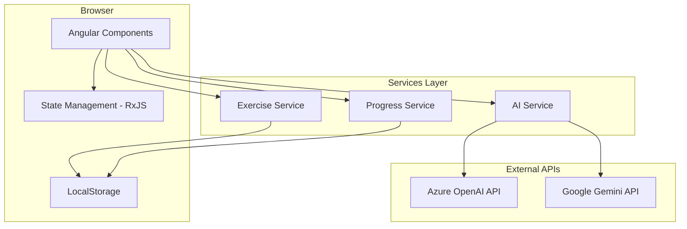

# Design Document

## Overview

The AI-powered English writing practice platform is built as a single-page Angular application that provides an interactive learning experience. The system architecture follows Angular best practices with a modular component structure, reactive state management using RxJS, and service-based API integration for AI feedback.

The platform supports two AI providers (Azure OpenAI and Google Gemini) through a unified service interface, allowing flexible configuration. User data is stored in browser localStorage for session persistence, while exercises are loaded from JSON configuration files.

## Architecture

### High-Level Architecture



### Component Hierarchy

```
AppComponent
├── HeaderComponent
├── RouterOutlet
│   ├── HomeComponent (Level & Category Selection)
│   ├── ExerciseListComponent
│   │   └── ExerciseCardComponent (multiple)
│   └── ExerciseDetailComponent
│       ├── SourceTextComponent
│       ├── TranslationInputComponent
│       ├── FeedbackPanelComponent
│       └── ProgressStatsComponent
└── FooterComponent
```

## Components and Interfaces

### 1. Core Data Models

```typescript
// models/exercise.model.ts
export enum DifficultyLevel {
  BEGINNER = 'beginner',
  INTERMEDIATE = 'intermediate',
  ADVANCED = 'advanced'
}

export enum ExerciseCategory {
  PERSONAL_COMMUNICATION = 'personal-communication',
  EVERYDAY_LIFE = 'everyday-life',
  TRANSPORTATION_TRAVEL = 'transportation-travel',
  SCHOOL_EDUCATION = 'school-education',
  WORK_BUSINESS = 'work-business',
  PUBLIC_SERVICES = 'public-services',
  HEALTH_MEDICINE = 'health-medicine',
  SHOPPING_MONEY = 'shopping-money',
  FOOD_DRINK = 'food-drink',
  ENTERTAINMENT_LEISURE = 'entertainment-leisure',
  NATURE_ENVIRONMENT = 'nature-environment',
  SCIENCE_TECHNOLOGY = 'science-technology',
  CULTURE_SOCIETY = 'culture-society',
  GOVERNMENT_POLITICS = 'government-politics',
  HISTORY_GEOGRAPHY = 'history-geography',
  SPORTS_FITNESS = 'sports-fitness',
  ARTS_LITERATURE = 'arts-literature',
  RELIGION_SPIRITUALITY = 'religion-spirituality',
  LAW_JUSTICE = 'law-justice',
  PHILOSOPHY_ETHICS = 'philosophy-ethics'
}

export interface Exercise {
  id: string;
  title: string;
  level: DifficultyLevel;
  category: ExerciseCategory;
  description: string;
  sourceText: string;
  highlightedSentences: string[];
  hints: string[];
  expectedKeywords?: string[];
}

export interface ExerciseAttempt {
  exerciseId: string;
  attemptNumber: number;
  userInput: string;
  accuracyScore: number;
  feedback: FeedbackItem[];
  timestamp: Date;
  hintsUsed: number;
}

export interface FeedbackItem {
  type: 'grammar' | 'vocabulary' | 'structure' | 'spelling' | 'suggestion';
  originalText: string;
  suggestion: string;
  explanation: string;
  startIndex: number;
  endIndex: number;
}
```

### 2. AI Service Interface

```typescript
// services/ai/ai-provider.interface.ts
export interface AIProvider {
  analyzeText(userInput: string, sourceText: string, context: ExerciseContext): Observable<AIResponse>;
  validateCredentials(): Observable<boolean>;
}

export interface ExerciseContext {
  level: DifficultyLevel;
  category: ExerciseCategory;
  hints: string[];
}

export interface AIResponse {
  accuracyScore: number;
  feedback: FeedbackItem[];
  overallComment: string;
}

// services/ai/azure-openai.service.ts
export class AzureOpenAIService implements AIProvider {
  private endpoint: string;
  private apiKey: string;
  private deploymentName: string;
  
  analyzeText(userInput: string, sourceText: string, context: ExerciseContext): Observable<AIResponse> {
    // Implementation using Azure OpenAI REST API
  }
}

// services/ai/gemini.service.ts
export class GeminiService implements AIProvider {
  private apiKey: string;
  private modelName: string;
  
  analyzeText(userInput: string, sourceText: string, context: ExerciseContext): Observable<AIResponse> {
    // Implementation using Google Gemini API
  }
}
```

### 3. Exercise Service

```typescript
// services/exercise.service.ts
@Injectable({ providedIn: 'root' })
export class ExerciseService {
  private exercises$ = new BehaviorSubject<Exercise[]>([]);
  private selectedLevel$ = new BehaviorSubject<DifficultyLevel | null>(null);
  private selectedCategory$ = new BehaviorSubject<ExerciseCategory | null>(null);
  
  constructor(private http: HttpClient) {
    this.loadExercises();
  }
  
  getFilteredExercises(): Observable<Exercise[]> {
    return combineLatest([
      this.exercises$,
      this.selectedLevel$,
      this.selectedCategory$
    ]).pipe(
      map(([exercises, level, category]) => 
        exercises.filter(ex => 
          (!level || ex.level === level) &&
          (!category || ex.category === category)
        )
      )
    );
  }
  
  setLevel(level: DifficultyLevel): void {
    this.selectedLevel$.next(level);
  }
  
  setCategory(category: ExerciseCategory): void {
    this.selectedCategory$.next(category);
  }
  
  getExerciseById(id: string): Observable<Exercise | undefined> {
    return this.exercises$.pipe(
      map(exercises => exercises.find(ex => ex.id === id))
    );
  }
  
  private loadExercises(): void {
    this.http.get<Exercise[]>('/assets/data/exercises.json')
      .subscribe(exercises => this.exercises$.next(exercises));
  }
}
```

### 4. Progress Service

```typescript
// services/progress.service.ts
@Injectable({ providedIn: 'root' })
export class ProgressService {
  private readonly STORAGE_KEY = 'user_progress';
  
  private progress$ = new BehaviorSubject<UserProgress>(this.loadProgress());
  
  getUserProgress(): Observable<UserProgress> {
    return this.progress$.asObservable();
  }
  
  recordAttempt(attempt: ExerciseAttempt): void {
    const current = this.progress$.value;
    const updated = {
      ...current,
      attempts: [...current.attempts, attempt],
      totalCredits: current.totalCredits + this.calculateCredits(attempt),
      totalPoints: current.totalPoints + attempt.accuracyScore,
      lastActivityDate: new Date()
    };
    
    this.progress$.next(updated);
    this.saveProgress(updated);
  }
  
  getExerciseStatus(exerciseId: string): ExerciseStatus {
    const attempts = this.progress$.value.attempts
      .filter(a => a.exerciseId === exerciseId);
    
    if (attempts.length === 0) return { status: 'new', attemptCount: 0 };
    return { 
      status: 'attempted', 
      attemptCount: attempts.length,
      bestScore: Math.max(...attempts.map(a => a.accuracyScore))
    };
  }
  
  calculateStreak(): number {
    // Calculate consecutive days of activity
  }
  
  private loadProgress(): UserProgress {
    const stored = localStorage.getItem(this.STORAGE_KEY);
    return stored ? JSON.parse(stored) : this.getDefaultProgress();
  }
  
  private saveProgress(progress: UserProgress): void {
    localStorage.setItem(this.STORAGE_KEY, JSON.stringify(progress));
  }
}

interface UserProgress {
  attempts: ExerciseAttempt[];
  totalCredits: number;
  totalPoints: number;
  lastActivityDate: Date;
  achievements: string[];
}

interface ExerciseStatus {
  status: 'new' | 'attempted';
  attemptCount: number;
  bestScore?: number;
}
```

### 5. AI Service Factory

```typescript
// services/ai/ai.service.ts
@Injectable({ providedIn: 'root' })
export class AIService {
  private provider: AIProvider;
  
  constructor(
    private azureService: AzureOpenAIService,
    private geminiService: GeminiService,
    private config: ConfigService
  ) {
    this.initializeProvider();
  }
  
  analyzeTranslation(
    userInput: string,
    exercise: Exercise
  ): Observable<AIResponse> {
    const context: ExerciseContext = {
      level: exercise.level,
      category: exercise.category,
      hints: exercise.hints
    };
    
    return this.provider.analyzeText(userInput, exercise.sourceText, context)
      .pipe(
        catchError(error => {
          console.error('AI Service Error:', error);
          return throwError(() => new Error('Failed to analyze text. Please try again.'));
        })
      );
  }
  
  private initializeProvider(): void {
    const providerType = this.config.get('aiProvider'); // 'azure' or 'gemini'
    this.provider = providerType === 'azure' 
      ? this.azureService 
      : this.geminiService;
  }
}
```

### 6. Key Components

#### HomeComponent (Level & Category Selection)

```typescript
@Component({
  selector: 'app-home',
  template: `
    <div class="selection-container">
      <section class="level-selection">
        <h2>Choose Your Level</h2>
        <div class="level-cards">
          <app-level-card 
            *ngFor="let level of levels"
            [level]="level"
            [selected]="selectedLevel === level"
            (select)="onLevelSelect(level)">
          </app-level-card>
        </div>
      </section>
      
      <section class="category-selection" *ngIf="selectedLevel">
        <h2>Select Category</h2>
        <div class="category-grid">
          <app-category-card
            *ngFor="let category of categories"
            [category]="category"
            (select)="onCategorySelect(category)">
          </app-category-card>
        </div>
      </section>
      
      <button 
        class="start-btn"
        *ngIf="selectedLevel && selectedCategory"
        (click)="navigateToExercises()">
        Start Practice
      </button>
    </div>
  `
})
export class HomeComponent {
  levels = [DifficultyLevel.BEGINNER, DifficultyLevel.INTERMEDIATE, DifficultyLevel.ADVANCED];
  categories = Object.values(ExerciseCategory);
  selectedLevel: DifficultyLevel | null = null;
  selectedCategory: ExerciseCategory | null = null;
  
  constructor(
    private exerciseService: ExerciseService,
    private router: Router
  ) {}
  
  onLevelSelect(level: DifficultyLevel): void {
    this.selectedLevel = level;
    this.exerciseService.setLevel(level);
  }
  
  onCategorySelect(category: ExerciseCategory): void {
    this.selectedCategory = category;
    this.exerciseService.setCategory(category);
  }
  
  navigateToExercises(): void {
    this.router.navigate(['/exercises']);
  }
}
```

#### ExerciseDetailComponent

```typescript
@Component({
  selector: 'app-exercise-detail',
  template: `
    <div class="exercise-container" *ngIf="exercise$ | async as exercise">
      <header class="exercise-header">
        <h1>{{ exercise.title }}</h1>
        <div class="stats">
          <span class="credits">{{ credits$ | async }} credits</span>
          <span class="points">{{ points$ | async }} points</span>
          <span class="progress">Progress: {{ progress }}%</span>
        </div>
      </header>
      
      <app-source-text 
        [text]="exercise.sourceText"
        [highlighted]="exercise.highlightedSentences">
      </app-source-text>
      
      <app-translation-input
        [(value)]="userInput"
        [disabled]="isSubmitting"
        placeholder="Enter your English translation here... (Only highlighted sentence)">
      </app-translation-input>
      
      <div class="actions">
        <button (click)="onQuit()">Quit</button>
        <button (click)="onHint()" [disabled]="!hasMoreHints">Hint</button>
        <button 
          (click)="onSubmit()" 
          [disabled]="!userInput || isSubmitting"
          class="submit-btn">
          Submit {{ creditsToEarn }}
        </button>
      </div>
      
      <app-feedback-panel
        *ngIf="feedback"
        [feedback]="feedback"
        [accuracyScore]="accuracyScore">
      </app-feedback-panel>
      
      <app-progress-stats
        [streak]="streak$ | async"
        [achievements]="achievements$ | async">
      </app-progress-stats>
    </div>
  `
})
export class ExerciseDetailComponent implements OnInit {
  exercise$: Observable<Exercise | undefined>;
  userInput = '';
  feedback: FeedbackItem[] | null = null;
  accuracyScore = 0;
  isSubmitting = false;
  hintsShown = 0;
  
  credits$: Observable<number>;
  points$: Observable<number>;
  streak$: Observable<number>;
  achievements$: Observable<string[]>;
  
  constructor(
    private route: ActivatedRoute,
    private router: Router,
    private exerciseService: ExerciseService,
    private aiService: AIService,
    private progressService: ProgressService
  ) {}
  
  ngOnInit(): void {
    const id = this.route.snapshot.paramMap.get('id')!;
    this.exercise$ = this.exerciseService.getExerciseById(id);
    
    const progress$ = this.progressService.getUserProgress();
    this.credits$ = progress$.pipe(map(p => p.totalCredits));
    this.points$ = progress$.pipe(map(p => p.totalPoints));
    this.streak$ = progress$.pipe(map(() => this.progressService.calculateStreak()));
    this.achievements$ = progress$.pipe(map(p => p.achievements));
  }
  
  onSubmit(): void {
    this.isSubmitting = true;
    
    this.exercise$.pipe(
      take(1),
      switchMap(exercise => 
        this.aiService.analyzeTranslation(this.userInput, exercise!)
      )
    ).subscribe({
      next: (response) => {
        this.feedback = response.feedback;
        this.accuracyScore = response.accuracyScore;
        this.recordAttempt();
        this.isSubmitting = false;
      },
      error: (error) => {
        alert(error.message);
        this.isSubmitting = false;
      }
    });
  }
  
  onHint(): void {
    // Show next hint from exercise.hints array
    this.hintsShown++;
  }
  
  onQuit(): void {
    this.router.navigate(['/exercises']);
  }
  
  private recordAttempt(): void {
    this.exercise$.pipe(take(1)).subscribe(exercise => {
      const attempt: ExerciseAttempt = {
        exerciseId: exercise!.id,
        attemptNumber: this.getAttemptNumber(exercise!.id),
        userInput: this.userInput,
        accuracyScore: this.accuracyScore,
        feedback: this.feedback!,
        timestamp: new Date(),
        hintsUsed: this.hintsShown
      };
      
      this.progressService.recordAttempt(attempt);
    });
  }
}
```

## Data Models

### Exercise Data Structure (JSON)

```json
{
  "exercises": [
    {
      "id": "ex-001",
      "title": "The Little Joy of a Child's Laugh",
      "level": "beginner",
      "category": "everyday-life",
      "description": "Translate a heartwarming passage about childhood moments",
      "sourceText": "Hôm nay là một ngày bận rộn với tôi. Tôi thức dậy sớm...",
      "highlightedSentences": [
        "Today is a busy day with me"
      ],
      "hints": [
        "Consider the correct preposition to use with 'busy day'",
        "Think about subject-verb agreement"
      ],
      "expectedKeywords": ["busy", "day", "for"]
    }
  ]
}
```

### Configuration Structure

```typescript
// environments/environment.ts
export const environment = {
  production: false,
  aiProvider: 'azure', // or 'gemini'
  azure: {
    endpoint: '',
    apiKey: '',
    deploymentName: 'gpt-4'
  },
  gemini: {
    apiKey: '',
    modelName: 'gemini-pro'
  }
};
```

## Error Handling

### AI Service Error Handling

1. **Network Errors**: Display "Connection failed. Please check your internet connection."
2. **Authentication Errors**: Display "Invalid API credentials. Please check your configuration."
3. **Rate Limiting**: Display "Too many requests. Please wait a moment and try again."
4. **Timeout**: Display "Request timed out. Please try again."
5. **Invalid Response**: Display "Unexpected response from AI service. Please try again."

### Error Handling Strategy

```typescript
// services/ai/error-handler.service.ts
@Injectable({ providedIn: 'root' })
export class AIErrorHandler {
  handleError(error: any): string {
    if (error.status === 401 || error.status === 403) {
      return 'Invalid API credentials. Please check your configuration.';
    }
    if (error.status === 429) {
      return 'Too many requests. Please wait a moment and try again.';
    }
    if (error.status === 0) {
      return 'Connection failed. Please check your internet connection.';
    }
    if (error.name === 'TimeoutError') {
      return 'Request timed out. Please try again.';
    }
    return 'An unexpected error occurred. Please try again.';
  }
}
```

## Testing Strategy

### Unit Testing

1. **Services Testing**
   - Test ExerciseService filtering logic
   - Test ProgressService calculations (streak, credits, points)
   - Mock AI service responses for AIService testing
   - Test localStorage interactions in ProgressService

2. **Component Testing**
   - Test HomeComponent level and category selection
   - Test ExerciseDetailComponent submission flow
   - Test FeedbackPanelComponent rendering with different feedback types
   - Test form validation in TranslationInputComponent

### Integration Testing

1. **AI Provider Integration**
   - Test Azure OpenAI service with mock API responses
   - Test Gemini service with mock API responses
   - Test provider switching logic

2. **Routing and Navigation**
   - Test navigation from home to exercise list
   - Test navigation from exercise list to exercise detail
   - Test route guards for invalid exercise IDs

### E2E Testing Scenarios

1. Complete user flow: Select level → Select category → View exercises → Complete exercise → View feedback
2. Progress persistence: Complete exercise → Refresh page → Verify progress retained
3. Error handling: Submit with invalid API key → Verify error message displayed
4. Responsive design: Test on mobile, tablet, and desktop viewports

## Responsive Design Strategy

### Breakpoints

- Mobile: < 768px
- Tablet: 768px - 1023px
- Desktop: ≥ 1024px

### Layout Adaptations

**Mobile**:
- Single column layout
- Stacked level/category cards
- Full-width input areas
- Collapsible feedback panel
- Bottom navigation

**Tablet**:
- Two-column grid for categories
- Side-by-side source text and input
- Expanded feedback panel

**Desktop**:
- Three-column grid for categories
- Split view: source text left, input/feedback right
- Fixed header with stats
- Sidebar for progress tracking

### SCSS Structure

```scss
// styles/breakpoints.scss
$mobile: 767px;
$tablet: 1023px;

@mixin mobile {
  @media (max-width: $mobile) { @content; }
}

@mixin tablet {
  @media (min-width: #{$mobile + 1}) and (max-width: $tablet) { @content; }
}

@mixin desktop {
  @media (min-width: #{$tablet + 1}) { @content; }
}
```

## AI Prompt Engineering

### Prompt Template for Text Analysis

```typescript
const ANALYSIS_PROMPT = `
You are an English language teacher providing feedback on a student's translation.

Source Text (Original Language):
${sourceText}

Student's English Translation:
${userInput}

Student Level: ${level}
Exercise Category: ${category}

Please analyze the student's translation and provide:
1. An accuracy score (0-100)
2. Specific feedback items with:
   - Error type (grammar/vocabulary/structure/spelling)
   - The problematic text
   - Suggested correction
   - Brief explanation
3. An overall encouraging comment

Format your response as JSON:
{
  "accuracyScore": number,
  "feedback": [
    {
      "type": "grammar|vocabulary|structure|spelling",
      "originalText": "text with error",
      "suggestion": "corrected text",
      "explanation": "why this is better"
    }
  ],
  "overallComment": "encouraging feedback"
}
`;
```

## Security Considerations

1. **API Key Protection**: Store API keys in environment files, never commit to version control
2. **Input Sanitization**: Sanitize user input before sending to AI services
3. **CORS Configuration**: Configure proper CORS headers for API requests
4. **Rate Limiting**: Implement client-side rate limiting to prevent abuse
5. **Data Privacy**: Store only necessary data in localStorage, no sensitive information

## Performance Optimization

1. **Lazy Loading**: Lazy load exercise list and detail routes
2. **Caching**: Cache exercise data after initial load
3. **Debouncing**: Debounce user input to reduce unnecessary processing
4. **Virtual Scrolling**: Use virtual scrolling for large exercise lists
5. **AOT Compilation**: Use Ahead-of-Time compilation for production builds
6. **Bundle Optimization**: Code splitting and tree shaking to reduce bundle size
