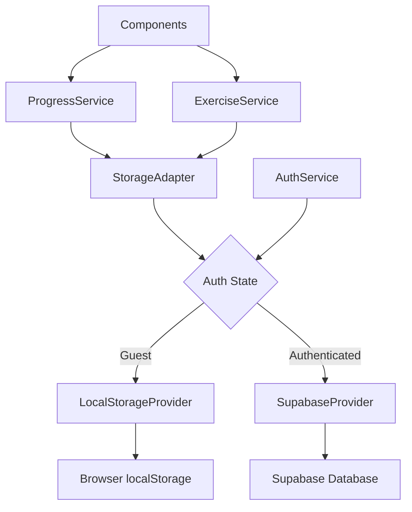
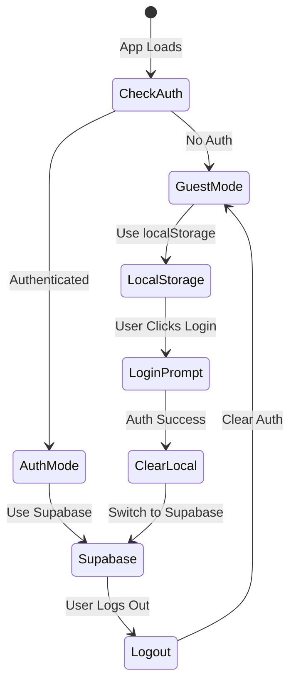

# Design Document: Guest Mode with localStorage

## Overview

This design implements a dual-storage system that allows guest users to use the application without authentication while storing their progress in browser localStorage. When users authenticate, the system transitions to Supabase storage and clears localStorage data. The design maintains a clean separation between storage mechanisms through an adapter pattern.

### Key Design Principles

1. **Storage Abstraction**: Use adapter pattern to abstract storage implementation details
2. **Authentication-Driven Routing**: Storage mechanism selection based on authentication state
3. **Data Isolation**: Complete separation between guest (localStorage) and authenticated (Supabase) data
4. **Graceful Degradation**: Handle storage quota and corruption errors without breaking the app
5. **Minimal Code Changes**: Leverage existing service architecture with minimal modifications

## Architecture

### High-Level Architecture



### Storage Selection Flow



## Components and Interfaces

### 1. Storage Adapter Interface

The `StorageAdapter` provides a unified interface for both storage mechanisms:

```typescript
interface StorageAdapter {
  // Progress Operations
  saveProgress(progress: UserProgress): Observable<void>;
  loadProgress(): Observable<UserProgress | null>;
  
  // Exercise History Operations
  saveExerciseAttempt(attempt: ExerciseAttempt): Observable<void>;
  getExerciseHistory(): Observable<{ [exerciseId: string]: ExerciseAttempt }>;
  
  // Dictation History Operations
  saveDictationAttempt(attempt: DictationPracticeAttempt): Observable<void>;
  getDictationHistory(): Observable<{ [exerciseId: string]: DictationPracticeAttempt }>;
  
  // Statistics Operations
  getStats(): Observable<UserStats>;
  updateStats(stats: Partial<UserStats>): Observable<void>;
  
  // Clear all data
  clearAll(): Observable<void>;
}

interface UserStats {
  totalPoints: number;
  totalCredits: number;
  currentStreak: number;
  longestStreak: number;
  lastStreakDate: string;
  lastActivityDate: Date;
  achievements: string[];
}
```

### 2. LocalStorage Provider

Implements `StorageAdapter` for guest users:

```typescript
@Injectable({
  providedIn: 'root'
})
export class LocalStorageProvider implements StorageAdapter {
  private readonly STORAGE_KEY = 'guest_progress';
  private readonly MAX_STORAGE_SIZE = 5 * 1024 * 1024; // 5MB limit
  
  saveProgress(progress: UserProgress): Observable<void> {
    try {
      const data = JSON.stringify(progress);
      if (data.length > this.MAX_STORAGE_SIZE) {
        throw new Error('Storage quota exceeded');
      }
      localStorage.setItem(this.STORAGE_KEY, data);
      return of(undefined);
    } catch (error) {
      return throwError(() => error);
    }
  }
  
  loadProgress(): Observable<UserProgress | null> {
    try {
      const data = localStorage.getItem(this.STORAGE_KEY);
      if (!data) return of(null);
      
      const progress = JSON.parse(data);
      return of(this.validateProgress(progress));
    } catch (error) {
      console.error('[LocalStorage] Corrupted data, resetting:', error);
      this.clearAll();
      return of(null);
    }
  }
  
  clearAll(): Observable<void> {
    localStorage.removeItem(this.STORAGE_KEY);
    return of(undefined);
  }
  
  private validateProgress(progress: any): UserProgress {
    // Validate and sanitize data structure
    return {
      exerciseHistory: progress.exerciseHistory || {},
      dictationHistory: progress.dictationHistory || {},
      totalCredits: progress.totalCredits || 0,
      totalPoints: progress.totalPoints || 0,
      lastActivityDate: new Date(progress.lastActivityDate || Date.now()),
      currentStreak: progress.currentStreak || 0,
      longestStreak: progress.longestStreak || 0,
      lastStreakDate: progress.lastStreakDate || '',
      achievements: progress.achievements || []
    };
  }
}
```

### 3. Supabase Provider

Implements `StorageAdapter` for authenticated users (wraps existing DatabaseService):

```typescript
@Injectable({
  providedIn: 'root'
})
export class SupabaseStorageProvider implements StorageAdapter {
  private databaseService = inject(DatabaseService);
  private authService = inject(AuthService);
  
  saveProgress(progress: UserProgress): Observable<void> {
    return this.databaseService.saveProgressAuto(progress);
  }
  
  loadProgress(): Observable<UserProgress | null> {
    return this.databaseService.loadProgressAuto();
  }
  
  clearAll(): Observable<void> {
    // Not implemented - Supabase data persists
    return of(undefined);
  }
}
```

### 4. Storage Adapter Factory

Creates the appropriate storage provider based on authentication state:

```typescript
@Injectable({
  providedIn: 'root'
})
export class StorageAdapterFactory {
  private authService = inject(AuthService);
  private localStorageProvider = inject(LocalStorageProvider);
  private supabaseProvider = inject(SupabaseStorageProvider);
  
  getAdapter(): StorageAdapter {
    return this.authService.isAuthenticated() 
      ? this.supabaseProvider 
      : this.localStorageProvider;
  }
  
  // Observable that emits when storage adapter should change
  getAdapterChanges(): Observable<StorageAdapter> {
    return this.authService.currentUser$.pipe(
      map(user => user ? this.supabaseProvider : this.localStorageProvider),
      distinctUntilChanged()
    );
  }
}
```

### 5. Updated Progress Service

Modify `ProgressService` to use the storage adapter:

```typescript
@Injectable({
  providedIn: 'root'
})
export class ProgressService {
  private storageFactory = inject(StorageAdapterFactory);
  private authService = inject(AuthService);
  private progress$ = new BehaviorSubject<UserProgress>(this.getDefaultProgress());
  private progressSignal = signal<UserProgress>(this.getDefaultProgress());
  
  constructor() {
    // Watch for auth changes
    effect(() => {
      const user = this.authService.currentUser();
      if (user) {
        this.handleLogin();
      } else {
        this.handleLogout();
      }
    });
    
    // Initial load
    this.loadProgress();
  }
  
  private loadProgress(): void {
    const adapter = this.storageFactory.getAdapter();
    adapter.loadProgress().subscribe({
      next: (progress) => {
        const data = progress || this.getDefaultProgress();
        this.progress$.next(data);
        this.progressSignal.set(data);
      },
      error: (error) => {
        console.error('[ProgressService] Load failed:', error);
        this.progress$.next(this.getDefaultProgress());
        this.progressSignal.set(this.getDefaultProgress());
      }
    });
  }
  
  private handleLogin(): void {
    // Clear localStorage when user logs in
    const localAdapter = inject(LocalStorageProvider);
    localAdapter.clearAll().subscribe(() => {
      console.log('[ProgressService] Guest data cleared on login');
      // Load from Supabase
      this.loadProgress();
    });
  }
  
  private handleLogout(): void {
    // Reset to default and load from localStorage
    this.progress$.next(this.getDefaultProgress());
    this.progressSignal.set(this.getDefaultProgress());
    this.loadProgress();
  }
  
  recordAttempt(attempt: ExerciseAttempt): void {
    const current = this.progress$.value;
    const streakUpdate = this.updateStreak(current);
    
    const updatedHistory = {
      ...current.exerciseHistory,
      [attempt.exerciseId]: attempt
    };
    
    const updated: UserProgress = {
      ...current,
      exerciseHistory: updatedHistory,
      totalCredits: current.totalCredits + this.calculateCredits(attempt),
      totalPoints: current.totalPoints + attempt.pointsEarned,
      lastActivityDate: new Date(),
      currentStreak: streakUpdate.currentStreak,
      lastStreakDate: streakUpdate.lastStreakDate,
      longestStreak: streakUpdate.longestStreak || current.longestStreak || 0
    };
    
    this.progress$.next(updated);
    this.progressSignal.set(updated);
    
    // Save using appropriate adapter
    const adapter = this.storageFactory.getAdapter();
    adapter.saveProgress(updated).subscribe({
      next: () => console.log('[ProgressService] Progress saved'),
      error: (error) => console.error('[ProgressService] Save failed:', error)
    });
  }
}
```

### 6. Auth Service Updates

Add login warning and localStorage clearing:

```typescript
@Injectable({
  providedIn: 'root'
})
export class AuthService {
  private modalService = inject(ModalService);
  
  signInWithGoogle(): Observable<void> {
    // Show warning modal before login
    return this.showLoginWarning().pipe(
      switchMap(confirmed => {
        if (!confirmed) {
          return of(undefined);
        }
        
        return from(
          this.supabase.auth.signInWithOAuth({
            provider: 'google',
            options: {
              redirectTo: `${window.location.origin}/home`,
              skipBrowserRedirect: false
            }
          }).then(({ error }) => {
            if (error) throw error;
          })
        );
      })
    );
  }
  
  private showLoginWarning(): Observable<boolean> {
    // Check if user has guest data
    const hasGuestData = localStorage.getItem('guest_progress') !== null;
    
    if (!hasGuestData) {
      return of(true); // No warning needed
    }
    
    // Show modal warning about data loss
    return this.modalService.confirm({
      title: 'Login Warning',
      message: 'Logging in will clear your current progress. Your data will be stored in the cloud instead. Continue?',
      confirmText: 'Login',
      cancelText: 'Cancel'
    });
  }
}
```

### 7. UI Components

#### Header Component Updates

Show login prompt for guest users:

```typescript
@Component({
  selector: 'app-header',
  template: `
    <header>
      @if (!isAuthenticated()) {
        <button (click)="login()" class="login-btn">
          <span>Login to Save Progress</span>
        </button>
      } @else {
        <div class="user-menu">
          
          <span>{{ displayName() }}</span>
          <button (click)="logout()">Logout</button>
        </div>
      }
    </header>
  `
})
export class Header {
  private authService = inject(AuthService);
  
  isAuthenticated = this.authService.isAuthenticated;
  displayName = computed(() => this.authService.getDisplayName());
  photoURL = computed(() => this.authService.getPhotoURL());
  
  login(): void {
    this.authService.signInWithGoogle().subscribe();
  }
  
  logout(): void {
    this.authService.signOut().subscribe();
  }
}
```

#### Login Warning Modal

```typescript
@Component({
  selector: 'app-login-warning-modal',
  template: `
    <div class="modal">
      <h2>Login Warning</h2>
      <p>Logging in will clear your current guest progress.</p>
      <p>Your data will be stored securely in the cloud and synced across devices.</p>
      <div class="actions">
        <button (click)="cancel()">Cancel</button>
        <button (click)="confirm()" class="primary">Continue to Login</button>
      </div>
    </div>
  `
})
export class LoginWarningModal {
  @Output() confirmed = new EventEmitter<boolean>();
  
  confirm(): void {
    this.confirmed.emit(true);
  }
  
  cancel(): void {
    this.confirmed.emit(false);
  }
}
```

## Data Models

### UserProgress Structure

Both localStorage and Supabase use the same data structure:

```typescript
interface UserProgress {
  exerciseHistory: { [exerciseId: string]: ExerciseAttempt };
  dictationHistory: { [exerciseId: string]: DictationPracticeAttempt };
  totalCredits: number;
  totalPoints: number;
  lastActivityDate: Date;
  currentStreak: number;
  longestStreak: number;
  lastStreakDate: string;
  achievements: string[];
}
```

### localStorage Key Structure

```
guest_progress: {
  exerciseHistory: {...},
  dictationHistory: {...},
  totalCredits: 0,
  totalPoints: 0,
  lastActivityDate: "2025-11-18T10:30:00Z",
  currentStreak: 3,
  longestStreak: 5,
  lastStreakDate: "2025-11-18",
  achievements: ["first-exercise", "1-day-streak"]
}
```

## Error Handling

### Storage Quota Exceeded

```typescript
private handleStorageQuotaError(): void {
  // Show user-friendly error
  this.toastService.error(
    'Storage limit reached. Please login to continue saving progress.'
  );
  
  // Optionally prompt login
  this.showLoginPrompt();
}
```

### Corrupted Data

```typescript
private handleCorruptedData(): void {
  console.error('[LocalStorage] Data corrupted, resetting');
  
  // Clear corrupted data
  localStorage.removeItem('guest_progress');
  
  // Reset to default
  this.progress$.next(this.getDefaultProgress());
  
  // Notify user
  this.toastService.warning(
    'Your progress data was corrupted and has been reset.'
  );
}
```

### Network Errors (Supabase)

```typescript
private handleNetworkError(error: any): void {
  console.error('[Supabase] Network error:', error);
  
  // Keep local state, retry later
  this.toastService.error(
    'Failed to sync progress. Will retry automatically.'
  );
  
  // Implement retry logic
  this.retrySync();
}
```

## Testing Strategy

### Unit Tests

1. **LocalStorageProvider Tests**
   - Test save/load operations
   - Test data validation
   - Test quota exceeded handling
   - Test corrupted data handling

2. **SupabaseStorageProvider Tests**
   - Test integration with DatabaseService
   - Test error handling
   - Test authentication state changes

3. **StorageAdapterFactory Tests**
   - Test adapter selection based on auth state
   - Test adapter switching on login/logout

4. **ProgressService Tests**
   - Test progress recording with both adapters
   - Test login transition (localStorage clear)
   - Test logout transition

### Integration Tests

1. **Guest User Flow**
   - Complete exercises as guest
   - Verify localStorage persistence
   - Verify progress display

2. **Login Flow**
   - Complete exercises as guest
   - Login with Google
   - Verify localStorage cleared
   - Verify fresh start with Supabase

3. **Logout Flow**
   - Login and complete exercises
   - Logout
   - Verify guest mode activated
   - Verify no previous localStorage data

### Manual Testing Checklist

- [ ] Guest user can complete exercises
- [ ] Progress persists across page refreshes
- [ ] Login warning modal appears when guest has data
- [ ] localStorage cleared after successful login
- [ ] Authenticated user data saved to Supabase
- [ ] Logout returns to guest mode
- [ ] No localStorage data after logout
- [ ] Storage quota error handled gracefully
- [ ] Corrupted data handled gracefully

## Performance Considerations

### localStorage Performance

- **Read Operations**: ~0.1ms (synchronous)
- **Write Operations**: ~1ms (synchronous)
- **Storage Limit**: 5-10MB per domain
- **Optimization**: Debounce writes to reduce frequency

### Supabase Performance

- **Read Operations**: ~50-200ms (network dependent)
- **Write Operations**: ~100-300ms (network dependent)
- **Optimization**: Batch updates, optimistic UI updates

### Memory Usage

- Keep progress data in memory (BehaviorSubject)
- Avoid redundant localStorage reads
- Clear unused data on logout

## Security Considerations

### localStorage Security

- **No Sensitive Data**: Only store progress data, no PII
- **XSS Protection**: Validate all data before parsing
- **Data Validation**: Sanitize user input before storage

### Supabase Security

- **RLS Policies**: Existing Row Level Security policies apply
- **Authentication**: OAuth via Google
- **Data Encryption**: TLS in transit, encrypted at rest

## Migration Path

### Existing Users

No migration needed - existing authenticated users continue using Supabase without changes.

### Future Enhancements

1. **Optional Data Migration**: Allow users to migrate guest data to authenticated account
2. **Export/Import**: Allow users to export guest data before login
3. **Multiple Devices**: Sync guest data across devices using QR code or link
4. **Progressive Enhancement**: Gradually add features exclusive to authenticated users

## Implementation Notes

### Phase 1: Core Infrastructure
- Create StorageAdapter interface
- Implement LocalStorageProvider
- Implement SupabaseStorageProvider
- Create StorageAdapterFactory

### Phase 2: Service Integration
- Update ProgressService to use adapter
- Update AuthService with login warning
- Add localStorage clearing on login

### Phase 3: UI Updates
- Update Header component
- Create LoginWarningModal
- Add guest user indicators

### Phase 4: Testing & Polish
- Write unit tests
- Perform integration testing
- Handle edge cases
- Performance optimization
