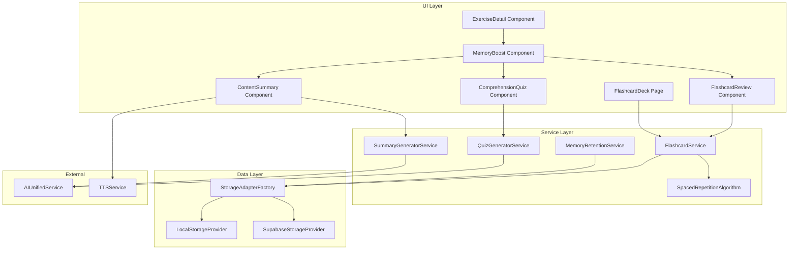

# Design Document: Memory Retention System

## Overview

Memory Retention System là một hệ thống toàn diện giúp người dùng ghi nhớ nội dung bài tập sau khi hoàn thành luyện tập. Hệ thống tích hợp 3 phương pháp khoa học về trí nhớ:

1. **Comprehension Quiz** - Câu hỏi kiểm tra hiểu bài sử dụng Active Recall
2. **Content Summary** - Tóm tắt nội dung và từ vựng quan trọng
3. **Flashcard System** - Hệ thống flashcard với Spaced Repetition

Hệ thống được thiết kế để tích hợp seamlessly vào flow hiện tại của exercise-detail component, hiển thị sau khi người dùng hoàn thành bài tập với điểm >= 75%.

## Architecture



## Components and Interfaces

### 1. MemoryBoost Component

Container component hiển thị trên màn hình hoàn thành bài tập.

```typescript
// src/app/components/memory-boost/memory-boost.ts
@Component({
  selector: 'app-memory-boost',
  templateUrl: './memory-boost.html',
  styleUrl: './memory-boost.scss',
  changeDetection: ChangeDetectionStrategy.OnPush
})
export class MemoryBoostComponent {
  exercise = input.required<Exercise>();
  userTranslation = input.required<string>();
  exerciseScore = input.required<number>();
  
  activeTab = signal<'quiz' | 'summary' | 'flashcards'>('quiz');
  quizCompleted = signal<boolean>(false);
  quizScore = signal<number>(0);
  flashcardsAdded = signal<number>(0);
  
  memoryData = signal<MemoryData | null>(null);
  isLoading = signal<boolean>(true);
  error = signal<string | null>(null);
  
  bonusPointsAwarded = output<number>();
}
```

### 2. ComprehensionQuiz Component

Component hiển thị và xử lý quiz kiểm tra hiểu bài.

```typescript
// src/app/components/comprehension-quiz/comprehension-quiz.ts
@Component({
  selector: 'app-comprehension-quiz',
  templateUrl: './comprehension-quiz.html',
  styleUrl: './comprehension-quiz.scss',
  changeDetection: ChangeDetectionStrategy.OnPush
})
export class ComprehensionQuizComponent {
  questions = input.required<QuizQuestion[]>();
  
  currentQuestionIndex = signal<number>(0);
  selectedAnswer = signal<number | null>(null);
  showExplanation = signal<boolean>(false);
  answers = signal<QuizAnswer[]>([]);
  
  quizCompleted = output<QuizResult>();
  
  currentQuestion = computed(() => this.questions()[this.currentQuestionIndex()]);
  progress = computed(() => ({
    current: this.currentQuestionIndex() + 1,
    total: this.questions().length
  }));
}
```

### 3. ContentSummary Component

Component hiển thị tóm tắt nội dung và từ vựng.

```typescript
// src/app/components/content-summary/content-summary.ts
@Component({
  selector: 'app-content-summary',
  templateUrl: './content-summary.html',
  styleUrl: './content-summary.scss',
  changeDetection: ChangeDetectionStrategy.OnPush
})
export class ContentSummaryComponent {
  summary = input.required<ContentSummaryData>();
  
  expandedVocab = signal<string | null>(null);
  
  vocabularyClicked = output<KeyVocabulary>();
  
  private ttsService = inject(TTSService);
  
  playPronunciation(vocab: KeyVocabulary): void {
    this.ttsService.speak(vocab.word);
    this.vocabularyClicked.emit(vocab);
  }
}
```

### 4. FlashcardReview Component

Component review flashcard trong Memory Boost section.

```typescript
// src/app/components/flashcard-review/flashcard-review.ts
@Component({
  selector: 'app-flashcard-review',
  templateUrl: './flashcard-review.html',
  styleUrl: './flashcard-review.scss',
  changeDetection: ChangeDetectionStrategy.OnPush
})
export class FlashcardReviewComponent {
  flashcards = input.required<Flashcard[]>();
  
  currentIndex = signal<number>(0);
  isFlipped = signal<boolean>(false);
  
  cardMarked = output<{ card: Flashcard; known: boolean }>();
  cardsAdded = output<number>();
  
  currentCard = computed(() => this.flashcards()[this.currentIndex()]);
  
  flipCard(): void {
    this.isFlipped.update(v => !v);
  }
  
  markCard(known: boolean): void {
    this.cardMarked.emit({ card: this.currentCard()!, known });
    this.nextCard();
  }
}
```

### 5. FlashcardDeck Page

Trang dedicated để review toàn bộ flashcard collection.

```typescript
// src/app/components/flashcard-deck/flashcard-deck.ts
@Component({
  selector: 'app-flashcard-deck',
  templateUrl: './flashcard-deck.html',
  styleUrl: './flashcard-deck.scss',
  changeDetection: ChangeDetectionStrategy.OnPush
})
export class FlashcardDeckComponent implements OnInit {
  private flashcardService = inject(FlashcardService);
  
  allCards = signal<Flashcard[]>([]);
  dueCards = signal<Flashcard[]>([]);
  
  filter = signal<FlashcardFilter>({ exercise: null, category: null, mastery: null });
  isReviewing = signal<boolean>(false);
  sessionStats = signal<ReviewSessionStats | null>(null);
  
  stats = computed<FlashcardStats>(() => ({
    total: this.allCards().length,
    due: this.dueCards().length,
    mastery: this.calculateMastery()
  }));
}
```

## Data Models

```typescript
// src/app/models/memory-retention.model.ts

// Quiz Models
export interface QuizQuestion {
  id: string;
  questionText: string;
  options: string[];
  correctIndex: number;
  explanation: string;
}

export interface QuizAnswer {
  questionId: string;
  selectedIndex: number;
  isCorrect: boolean;
}

export interface QuizResult {
  exerciseId: string;
  questions: QuizQuestion[];
  answers: QuizAnswer[];
  score: number; // percentage
  completedAt: Date;
}

// Summary Models
export interface KeyVocabulary {
  word: string;
  meaning: string; // Vietnamese
  exampleSentence: string;
  partOfSpeech?: string;
}

export interface MainIdea {
  english: string;
  vietnamese: string;
}

export interface ContentSummaryData {
  exerciseId: string;
  mainIdeas: MainIdea[];
  vocabulary: KeyVocabulary[];
  generatedAt: Date;
}

// Flashcard Models
export interface Flashcard {
  id: string;
  front: string; // English word/phrase
  back: string; // Vietnamese meaning
  exerciseId: string;
  category?: string;
  createdAt: Date;
  
  // Spaced Repetition fields
  easeFactor: number; // default 2.5
  interval: number; // days
  nextReviewDate: Date;
  reviewCount: number;
  lastReviewDate?: Date;
}

export interface FlashcardFilter {
  exercise: string | null;
  category: string | null;
  mastery: 'new' | 'learning' | 'mastered' | null;
}

export interface FlashcardStats {
  total: number;
  due: number;
  mastery: number; // percentage
}

export interface ReviewSessionStats {
  cardsReviewed: number;
  correctCount: number;
  accuracy: number;
  timeSpent: number; // seconds
  startedAt: Date;
  endedAt: Date;
}

// Combined Memory Data
export interface MemoryData {
  exerciseId: string;
  quiz?: {
    questions: QuizQuestion[];
    result?: QuizResult;
  };
  summary?: ContentSummaryData;
  flashcards?: Flashcard[];
  generatedAt: Date;
}

// Storage Models
export interface MemoryRetentionStorage {
  memoryData: { [exerciseId: string]: MemoryData };
  flashcards: Flashcard[];
  quizResults: { [exerciseId: string]: QuizResult };
}
```

## Services

### QuizGeneratorService

```typescript
// src/app/services/quiz-generator.service.ts
@Injectable({ providedIn: 'root' })
export class QuizGeneratorService {
  private aiService = inject(AIUnifiedService);
  
  generateQuiz(exercise: Exercise, userTranslation: string): Observable<QuizQuestion[]> {
    const prompt = this.buildQuizPrompt(exercise, userTranslation);
    return this.aiService.generateText(prompt).pipe(
      map(response => this.parseQuizResponse(response)),
      catchError(error => {
        console.error('Quiz generation failed:', error);
        return throwError(() => new Error('Failed to generate quiz questions'));
      })
    );
  }
  
  private buildQuizPrompt(exercise: Exercise, userTranslation: string): string {
    return `Based on the following passage, generate 2-3 comprehension questions that test understanding of the main ideas.

Vietnamese passage:
${exercise.sourceText}

English translation:
${userTranslation}

Generate questions in JSON format:
[
  {
    "questionText": "What is the main topic of this passage?",
    "options": ["Option A", "Option B", "Option C", "Option D"],
    "correctIndex": 0,
    "explanation": "The passage discusses..."
  }
]

Rules:
- Questions should test comprehension, not word-for-word recall
- Include 4 answer options per question
- Provide clear explanations for correct answers
- Questions can be in English or Vietnamese`;
  }
}
```

### SummaryGeneratorService

```typescript
// src/app/services/summary-generator.service.ts
@Injectable({ providedIn: 'root' })
export class SummaryGeneratorService {
  private aiService = inject(AIUnifiedService);
  
  generateSummary(exercise: Exercise, userTranslation: string): Observable<ContentSummaryData> {
    const prompt = this.buildSummaryPrompt(exercise, userTranslation);
    return this.aiService.generateText(prompt).pipe(
      map(response => this.parseSummaryResponse(response, exercise.id)),
      catchError(error => {
        console.error('Summary generation failed:', error);
        // Return fallback with original text
        return of(this.createFallbackSummary(exercise));
      })
    );
  }
  
  private buildSummaryPrompt(exercise: Exercise, userTranslation: string): string {
    return `Analyze the following passage and extract:
1. 2-3 main ideas (in both English and Vietnamese)
2. 5-8 key vocabulary words with meanings and example sentences

Vietnamese passage:
${exercise.sourceText}

English translation:
${userTranslation}

Return JSON format:
{
  "mainIdeas": [
    { "english": "...", "vietnamese": "..." }
  ],
  "vocabulary": [
    { "word": "example", "meaning": "ví dụ", "exampleSentence": "This is an example.", "partOfSpeech": "noun" }
  ]
}`;
  }
}
```

### FlashcardService

```typescript
// src/app/services/flashcard.service.ts
@Injectable({ providedIn: 'root' })
export class FlashcardService {
  private storageFactory = inject(StorageAdapterFactory);
  
  private flashcards = signal<Flashcard[]>([]);
  
  // Expose as readonly
  readonly allFlashcards = this.flashcards.asReadonly();
  
  readonly dueFlashcards = computed(() => {
    const now = new Date();
    return this.flashcards().filter(card => 
      new Date(card.nextReviewDate) <= now
    ).sort((a, b) => 
      new Date(a.nextReviewDate).getTime() - new Date(b.nextReviewDate).getTime()
    );
  });
  
  readonly stats = computed<FlashcardStats>(() => ({
    total: this.flashcards().length,
    due: this.dueFlashcards().length,
    mastery: this.calculateMastery()
  }));
  
  addFlashcards(cards: Flashcard[]): Observable<void> {
    const newCards = cards.map(card => ({
      ...card,
      id: card.id || this.generateId(),
      easeFactor: 2.5,
      interval: 0,
      nextReviewDate: new Date(),
      reviewCount: 0,
      createdAt: new Date()
    }));
    
    this.flashcards.update(existing => [...existing, ...newCards]);
    return this.persist();
  }
  
  markCard(cardId: string, known: boolean): Observable<void> {
    this.flashcards.update(cards => cards.map(card => {
      if (card.id !== cardId) return card;
      
      const newInterval = known 
        ? Math.min(Math.max(card.interval * 2.5, 1), 180)
        : 1;
      
      const nextReviewDate = new Date();
      nextReviewDate.setDate(nextReviewDate.getDate() + newInterval);
      
      return {
        ...card,
        interval: newInterval,
        easeFactor: known ? Math.min(card.easeFactor + 0.1, 3.0) : Math.max(card.easeFactor - 0.2, 1.3),
        nextReviewDate,
        reviewCount: card.reviewCount + 1,
        lastReviewDate: new Date()
      };
    }));
    
    return this.persist();
  }
  
  deleteCard(cardId: string): Observable<void> {
    this.flashcards.update(cards => cards.filter(c => c.id !== cardId));
    return this.persist();
  }
  
  getCardsByExercise(exerciseId: string): Flashcard[] {
    return this.flashcards().filter(c => c.exerciseId === exerciseId);
  }
  
  filterCards(filter: FlashcardFilter): Flashcard[] {
    return this.flashcards().filter(card => {
      if (filter.exercise && card.exerciseId !== filter.exercise) return false;
      if (filter.category && card.category !== filter.category) return false;
      if (filter.mastery) {
        const mastery = this.getCardMastery(card);
        if (mastery !== filter.mastery) return false;
      }
      return true;
    });
  }
  
  private getCardMastery(card: Flashcard): 'new' | 'learning' | 'mastered' {
    if (card.reviewCount === 0) return 'new';
    if (card.interval >= 21) return 'mastered';
    return 'learning';
  }
  
  private calculateMastery(): number {
    const cards = this.flashcards();
    if (cards.length === 0) return 0;
    const mastered = cards.filter(c => this.getCardMastery(c) === 'mastered').length;
    return Math.round((mastered / cards.length) * 100);
  }
}
```

### MemoryRetentionService

```typescript
// src/app/services/memory-retention.service.ts
@Injectable({ providedIn: 'root' })
export class MemoryRetentionService {
  private quizGenerator = inject(QuizGeneratorService);
  private summaryGenerator = inject(SummaryGeneratorService);
  private flashcardService = inject(FlashcardService);
  private storageFactory = inject(StorageAdapterFactory);
  
  private memoryDataCache = signal<Map<string, MemoryData>>(new Map());
  
  generateMemoryContent(exercise: Exercise, userTranslation: string): Observable<MemoryData> {
    // Check cache first
    const cached = this.memoryDataCache().get(exercise.id);
    if (cached) {
      return of(cached);
    }
    
    return forkJoin({
      quiz: this.quizGenerator.generateQuiz(exercise, userTranslation).pipe(
        catchError(() => of([]))
      ),
      summary: this.summaryGenerator.generateSummary(exercise, userTranslation)
    }).pipe(
      map(({ quiz, summary }) => {
        const memoryData: MemoryData = {
          exerciseId: exercise.id,
          quiz: { questions: quiz },
          summary,
          flashcards: this.createFlashcardsFromSummary(summary, exercise.id),
          generatedAt: new Date()
        };
        
        // Cache the result
        this.memoryDataCache.update(cache => {
          const newCache = new Map(cache);
          newCache.set(exercise.id, memoryData);
          return newCache;
        });
        
        return memoryData;
      })
    );
  }
  
  saveQuizResult(result: QuizResult): Observable<void> {
    return this.storageFactory.getAdapter().pipe(
      switchMap(adapter => adapter.saveMemoryData('quizResults', result.exerciseId, result))
    );
  }
  
  loadMemoryData(exerciseId: string): Observable<MemoryData | null> {
    return this.storageFactory.getAdapter().pipe(
      switchMap(adapter => adapter.loadMemoryData(exerciseId))
    );
  }
  
  private createFlashcardsFromSummary(summary: ContentSummaryData, exerciseId: string): Flashcard[] {
    return summary.vocabulary.map(vocab => ({
      id: this.generateId(),
      front: vocab.word,
      back: vocab.meaning,
      exerciseId,
      category: summary.exerciseId,
      createdAt: new Date(),
      easeFactor: 2.5,
      interval: 0,
      nextReviewDate: new Date(),
      reviewCount: 0
    }));
  }
}
```

## Correctness Properties

*A property is a characteristic or behavior that should hold true across all valid executions of a system-essentially, a formal statement about what the system should do. Properties serve as the bridge between human-readable specifications and machine-verifiable correctness guarantees.*

### Property 1: Quiz Generation Threshold

*For any* exercise completion with a score, quiz generation SHALL be triggered if and only if the score is >= 75%.

**Validates: Requirements 1.1, 4.1**

### Property 2: Quiz Question Structure Completeness

*For any* generated QuizQuestion, it SHALL contain a non-empty questionText, exactly 4 options, a correctIndex between 0-3, and a non-empty explanation.

**Validates: Requirements 1.3**

### Property 3: Quiz Answer Feedback Immediacy

*For any* answer selection in the quiz, the system SHALL immediately update showExplanation to true and display whether the answer is correct.

**Validates: Requirements 1.6**

### Property 4: Quiz Summary Accuracy

*For any* completed quiz with N questions and C correct answers, the displayed score SHALL equal (C/N) * 100.

**Validates: Requirements 1.7**

### Property 5: Vocabulary Extraction Bounds

*For any* generated ContentSummaryData, the vocabulary array SHALL contain between 5 and 8 items inclusive.

**Validates: Requirements 2.2**

### Property 6: Vocabulary Item Completeness

*For any* KeyVocabulary item, it SHALL contain a non-empty word, meaning, and exampleSentence.

**Validates: Requirements 2.3**

### Property 7: Main Ideas Bilingual Completeness

*For any* MainIdea item, it SHALL contain both non-empty english and vietnamese strings.

**Validates: Requirements 2.6**

### Property 8: Flashcard Structure Completeness

*For any* Flashcard, it SHALL contain non-empty front, back, exerciseId, and valid createdAt timestamp, plus spaced repetition fields (easeFactor, interval, nextReviewDate).

**Validates: Requirements 3.2, 7.4**

### Property 9: Spaced Repetition Interval Adjustment

*For any* flashcard review:
- If marked "Know", the new interval SHALL be min(max(currentInterval * 2.5, 1), 180)
- If marked "Don't Know", the new interval SHALL be exactly 1

**Validates: Requirements 3.5, 3.6, 7.2, 7.3**

### Property 10: Due Cards Calculation

*For any* flashcard collection, the due cards set SHALL contain exactly those cards where nextReviewDate <= currentDate.

**Validates: Requirements 7.5**

### Property 11: Flashcard Sorting by Urgency

*For any* due cards list, cards SHALL be sorted in ascending order by nextReviewDate.

**Validates: Requirements 5.2**

### Property 12: Flashcard Filter Correctness

*For any* filter application, the resulting card set SHALL contain only cards matching ALL specified filter criteria.

**Validates: Requirements 5.6**

### Property 13: Session Statistics Accuracy

*For any* review session with N cards reviewed and C marked as "Know", the accuracy SHALL equal (C/N) * 100.

**Validates: Requirements 5.4, 5.5**

### Property 14: Storage Routing by Auth State

*For any* data persistence operation:
- If user is authenticated, data SHALL be saved to Supabase
- If user is guest, data SHALL be saved to localStorage

**Validates: Requirements 6.2, 6.3**

### Property 15: Quiz Bonus Points Award

*For any* quiz completion with score >= 80%, exactly 5 bonus points SHALL be awarded.

**Validates: Requirements 4.4**

### Property 16: Flashcard Deletion Completeness

*For any* flashcard deletion, the card SHALL be removed from the collection and the total count SHALL decrease by 1.

**Validates: Requirements 5.7**

### Property 17: Memory Data Caching

*For any* exercise with previously generated memory data, subsequent loads SHALL return the cached data without regenerating.

**Validates: Requirements 6.5**

## Error Handling

### AI Service Failures

1. **Quiz Generation Failure**
   - Display user-friendly error message
   - Allow user to skip quiz and proceed to other tabs
   - Log error for debugging

2. **Summary Generation Failure**
   - Fall back to displaying original passage text
   - Show message indicating AI summary unavailable
   - Still allow flashcard creation from manual selection

### Storage Failures

1. **Save Failure**
   - Retry up to 3 times with exponential backoff
   - Show toast notification on persistent failure
   - Keep data in memory to prevent loss

2. **Load Failure**
   - Return empty/default state
   - Allow regeneration of content

### Network Failures

1. **Offline Mode**
   - Use cached data when available
   - Queue operations for sync when online
   - Show offline indicator

## Testing Strategy

### Unit Tests

Unit tests focus on specific examples and edge cases:

1. **QuizGeneratorService**
   - Test prompt building with various exercise types
   - Test JSON parsing of AI responses
   - Test error handling for malformed responses

2. **FlashcardService**
   - Test card addition with duplicate detection
   - Test deletion of non-existent cards
   - Test filter combinations

3. **Components**
   - Test tab switching behavior
   - Test quiz answer selection flow
   - Test flashcard flip animation trigger

### Property-Based Tests

Property-based tests verify universal properties across all inputs using fast-check library:

1. **Quiz Structure Property Test**
   - Generate random quiz questions
   - Verify all structural requirements (Property 2)
   - Minimum 100 iterations

2. **Spaced Repetition Property Test**
   - Generate random flashcards with various intervals
   - Apply "Know" and "Don't Know" actions
   - Verify interval bounds (Property 9)
   - Minimum 100 iterations

3. **Filter Property Test**
   - Generate random flashcard collections
   - Apply random filter combinations
   - Verify filter correctness (Property 12)
   - Minimum 100 iterations

4. **Statistics Property Test**
   - Generate random review sessions
   - Verify accuracy calculations (Property 13)
   - Minimum 100 iterations

### Integration Tests

1. **Memory Boost Flow**
   - Complete exercise → Memory Boost appears
   - Complete quiz → Bonus points awarded
   - Add flashcards → Confirmation shown

2. **Data Persistence**
   - Save data → Reload page → Data restored
   - Guest mode → Login → Data merged

### Test Configuration

```typescript
// Use fast-check for property-based testing
import * as fc from 'fast-check';

// Configure minimum 100 iterations
const fcConfig = { numRuns: 100 };

// Example property test
describe('FlashcardService', () => {
  it('Property 9: Spaced Repetition Interval Adjustment', () => {
    fc.assert(
      fc.property(
        fc.record({
          interval: fc.integer({ min: 0, max: 180 }),
          known: fc.boolean()
        }),
        ({ interval, known }) => {
          const newInterval = calculateNewInterval(interval, known);
          if (known) {
            expect(newInterval).toBeGreaterThanOrEqual(1);
            expect(newInterval).toBeLessThanOrEqual(180);
            expect(newInterval).toBe(Math.min(Math.max(interval * 2.5, 1), 180));
          } else {
            expect(newInterval).toBe(1);
          }
        }
      ),
      fcConfig
    );
  });
});
```
