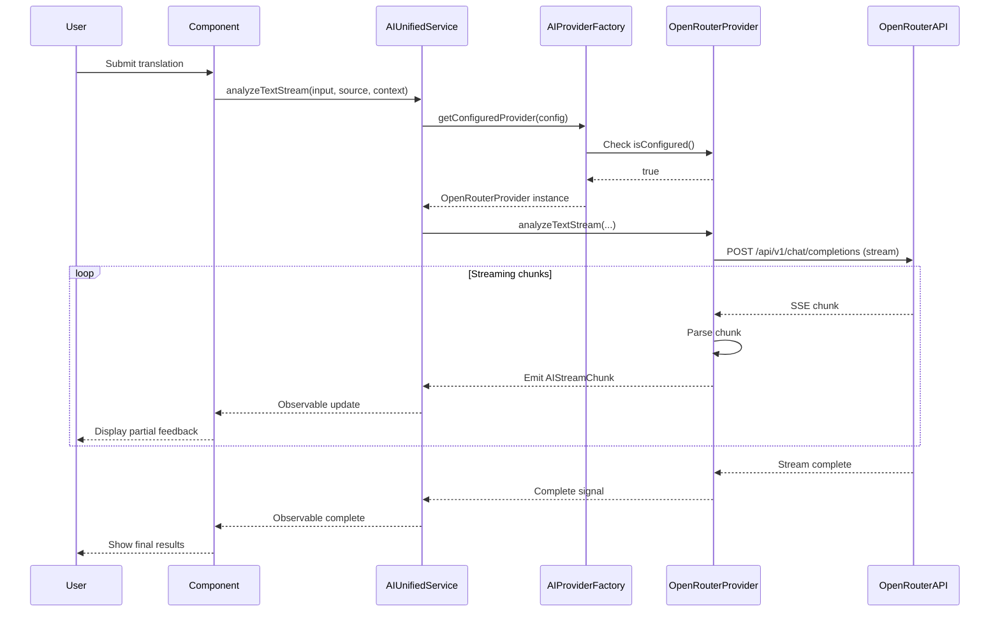

# Design Document: OpenRouter Integration

## Overview

This design implements OpenRouter as a new AI provider for the English learning application. OpenRouter provides unified access to multiple free AI models through a single API endpoint, reducing complexity and cost while maintaining quality feedback for translation analysis, hint generation, and exercise support.

The implementation follows the existing provider pattern, extending `BaseAIProvider` and integrating with `AIProviderFactory`. OpenRouter's streaming API will be leveraged for real-time feedback delivery.

## Architecture

### High-Level Architecture

```
┌─────────────────────────────────────────────────────────────┐
│                     Application Layer                        │
│  (Components: ExerciseDetail, TranslationFeedback, etc.)    │
└────────────────────────┬────────────────────────────────────┘
                         │
                         ▼
┌─────────────────────────────────────────────────────────────┐
│                   AI Unified Service                         │
│              (Orchestrates AI operations)                    │
└────────────────────────┬────────────────────────────────────┘
                         │
                         ▼
┌─────────────────────────────────────────────────────────────┐
│                  AI Provider Factory                         │
│         (Selects and instantiates providers)                │
└────────────────────────┬────────────────────────────────────┘
                         │
         ┌───────────────┼───────────────┬──────────────┐
         ▼               ▼               ▼              ▼
    ┌────────┐    ┌──────────┐    ┌─────────┐   ┌────────────┐
    │ Azure  │    │  OpenAI  │    │ Gemini  │   │ OpenRouter │ ← NEW
    │Provider│    │ Provider │    │Provider │   │  Provider  │
    └────────┘    └──────────┘    └─────────┘   └────────────┘
         │               │               │              │
         └───────────────┴───────────────┴──────────────┘
                         │
                         ▼
              ┌──────────────────────┐
              │   External AI APIs   │
              └──────────────────────┘
```

### Provider Integration Flow



## Components and Interfaces

### 1. OpenRouterProvider Class

**File**: `src/app/services/ai/providers/openrouter.provider.ts`

**Responsibilities**:
- Implement BaseAIProvider interface
- Handle HTTP communication with OpenRouter API
- Parse streaming responses
- Manage error handling and retries
- Support multiple free models

**Key Methods**:

```typescript
export class OpenRouterProvider extends BaseAIProvider {
  private promptService = inject(PromptService);
  
  // Provider identification
  get name(): string;
  
  // Configuration validation
  isConfigured(config: any): boolean;
  
  // Core text generation
  generateText(request: AIRequest, config: any): Observable<string>;
  
  // Translation analysis (non-streaming)
  analyzeText(
    userInput: string,
    sourceText: string,
    context: ExerciseContext,
    config: any
  ): Observable<AIResponse>;
  
  // Translation analysis (streaming)
  analyzeTextStream(
    userInput: string,
    sourceText: string,
    context: ExerciseContext,
    config: any
  ): Observable<AIStreamChunk>;
  
  // Hint generation
  generateHint(
    sourceText: string,
    userInput: string,
    previousHints: string[],
    context: ExerciseContext,
    config: any
  ): Observable<string>;
  
  // Private helper methods
  private parseResponse(content: string): AIResponse;
  private emitPartialResponse(buffer: string, observer: any): void;
  private handleError(error: any): string;
}
```

### 2. Configuration Extension

**File**: `src/app/models/ai.model.ts`

**Changes**: Extend AIConfig interface to include OpenRouter configuration

```typescript
export interface AIConfig {
  provider: 'azure' | 'gemini' | 'openai' | 'openrouter'; // Add 'openrouter'
  azure?: {
    endpoint: string;
    apiKey: string;
    deploymentName: string;
  };
  gemini?: {
    apiKey: string;
    modelName: string;
  };
  openai?: {
    apiKey: string;
    modelName: string;
  };
  openrouter?: {  // NEW
    apiKey: string;
    modelName: string;
    siteUrl?: string;      // Optional: for usage tracking
    siteName?: string;     // Optional: for usage tracking
  };
}
```

### 3. Environment Configuration

**File**: `src/environments/environment.ts`

**Changes**: Add OpenRouter to provider options and configuration

```typescript
export const environment = {
  production: false,
  aiProvider: 'openrouter' as 'azure' | 'gemini' | 'openai' | 'openrouter',
  // ... existing config
};
```

### 4. Factory Registration

**File**: `src/app/services/ai/ai-provider.factory.ts`

**Changes**: Register OpenRouter provider in the factory

```typescript
export class AIProviderFactory {
  private azureProvider = inject(AzureOpenAIProvider);
  private openaiProvider = inject(OpenAIProvider);
  private geminiProvider = inject(GeminiProvider);
  private openrouterProvider = inject(OpenRouterProvider); // NEW

  constructor() {
    this.providers = new Map<string, BaseAIProvider>();
    this.providers.set('azure', this.azureProvider);
    this.providers.set('openai', this.openaiProvider);
    this.providers.set('gemini', this.geminiProvider);
    this.providers.set('openrouter', this.openrouterProvider); // NEW
  }
  // ... rest of implementation
}
```

## Data Models

### OpenRouter API Request Format

```typescript
interface OpenRouterRequest {
  model: string;                    // e.g., "meta-llama/llama-3.2-3b-instruct:free"
  messages: Array<{
    role: 'system' | 'user' | 'assistant';
    content: string;
  }>;
  temperature?: number;             // 0.0 to 2.0, default 0.7
  max_tokens?: number;              // Optional token limit
  stream?: boolean;                 // Enable streaming responses
  // Optional metadata for tracking
  transforms?: string[];            // e.g., ["middle-out"]
  route?: 'fallback';              // Routing strategy
}
```

### OpenRouter API Response Format (Non-Streaming)

```typescript
interface OpenRouterResponse {
  id: string;
  model: string;
  created: number;
  object: 'chat.completion';
  choices: Array<{
    index: number;
    message: {
      role: 'assistant';
      content: string;
    };
    finish_reason: 'stop' | 'length' | 'content_filter';
  }>;
  usage: {
    prompt_tokens: number;
    completion_tokens: number;
    total_tokens: number;
  };
}
```

### OpenRouter API Response Format (Streaming)

Server-Sent Events (SSE) format:
```
data: {"id":"gen-123","choices":[{"delta":{"content":"Hello"}}]}

data: {"id":"gen-123","choices":[{"delta":{"content":" world"}}]}

data: [DONE]
```

### Supported Free Models

```typescript
const OPENROUTER_FREE_MODELS = {
  // Meta Llama models - excellent for instruction following
  'meta-llama/llama-3.2-3b-instruct:free': {
    name: 'Llama 3.2 3B Instruct',
    strengths: ['Fast responses', 'Good for basic feedback', 'Low latency'],
    contextWindow: 128000,
    recommended: 'Quick feedback for simple exercises'
  },
  'meta-llama/llama-3.1-8b-instruct:free': {
    name: 'Llama 3.1 8B Instruct',
    strengths: ['Balanced quality', 'Detailed analysis', 'Consistent output'],
    contextWindow: 128000,
    recommended: 'General purpose translation analysis'
  },
  
  // Google Gemma - optimized for language tasks
  'google/gemma-2-9b-it:free': {
    name: 'Gemma 2 9B IT',
    strengths: ['Language understanding', 'Grammar analysis', 'Natural explanations'],
    contextWindow: 8192,
    recommended: 'Grammar and style feedback'
  },
  
  // Microsoft Phi - efficient and accurate
  'microsoft/phi-3-mini-128k-instruct:free': {
    name: 'Phi-3 Mini 128K',
    strengths: ['Large context', 'Efficient', 'Good reasoning'],
    contextWindow: 128000,
    recommended: 'Long text analysis with full context'
  },
  
  // Mistral - strong general purpose model
  'mistralai/mistral-7b-instruct:free': {
    name: 'Mistral 7B Instruct',
    strengths: ['Reliable', 'Well-balanced', 'Good explanations'],
    contextWindow: 32768,
    recommended: 'Comprehensive feedback with explanations'
  },
  
  // Qwen - multilingual capabilities
  'qwen/qwen-2-7b-instruct:free': {
    name: 'Qwen 2 7B Instruct',
    strengths: ['Multilingual', 'Cultural context', 'Nuanced feedback'],
    contextWindow: 32768,
    recommended: 'Cross-cultural translation nuances'
  },
  
  // Zephyr - fine-tuned for helpfulness
  'huggingfaceh4/zephyr-7b-beta:free': {
    name: 'Zephyr 7B Beta',
    strengths: ['Helpful tone', 'Clear suggestions', 'Student-friendly'],
    contextWindow: 32768,
    recommended: 'Beginner-friendly feedback'
  }
};
```

## Error Handling

### Error Classification and Handling Strategy

```typescript
class OpenRouterErrorHandler {
  handleError(error: any): { message: string; shouldRetry: boolean } {
    // Network errors
    if (error instanceof TypeError && error.message.includes('fetch')) {
      return {
        message: 'Network error. Please check your internet connection.',
        shouldRetry: true
      };
    }
    
    // HTTP errors
    if (error.status) {
      switch (error.status) {
        case 401:
          return {
            message: 'Invalid API key. Please check your OpenRouter configuration.',
            shouldRetry: false
          };
        case 429:
          return {
            message: 'Rate limit exceeded. Please try again in a moment.',
            shouldRetry: true
          };
        case 500:
        case 502:
        case 503:
          return {
            message: 'OpenRouter service temporarily unavailable. Please try again.',
            shouldRetry: true
          };
        default:
          return {
            message: `API error: ${error.statusText || 'Unknown error'}`,
            shouldRetry: false
          };
      }
    }
    
    // Parsing errors
    if (error instanceof SyntaxError) {
      return {
        message: 'Failed to parse AI response. Please try again.',
        shouldRetry: true
      };
    }
    
    // Generic errors
    return {
      message: 'An unexpected error occurred. Please try again.',
      shouldRetry: false
    };
  }
}
```

### Retry Strategy

- **Network errors**: Retry up to 2 times with exponential backoff (1s, 2s)
- **Rate limit errors**: Wait 5 seconds before retry
- **Server errors (5xx)**: Retry once after 2 seconds
- **Client errors (4xx)**: No retry, display error immediately
- **Streaming errors**: Close stream, emit error, allow user to retry manually

## Testing Strategy

### Unit Tests

**File**: `src/app/services/ai/providers/openrouter.provider.spec.ts`

Test coverage:

1. **Configuration Validation**
   - `isConfigured()` returns true with valid config
   - `isConfigured()` returns false with missing apiKey
   - `isConfigured()` returns false with missing modelName

2. **Text Generation**
   - `generateText()` sends correct request format
   - `generateText()` parses response correctly
   - `generateText()` handles API errors
   - `generateText()` includes temperature in request

3. **Translation Analysis**
   - `analyzeText()` builds correct prompt using PromptService
   - `analyzeText()` parses JSON response into AIResponse
   - `analyzeText()` handles malformed JSON gracefully
   - `analyzeText()` extracts accuracyScore and feedback items

4. **Streaming Analysis**
   - `analyzeTextStream()` emits score chunk when score appears
   - `analyzeTextStream()` emits feedback chunks progressively
   - `analyzeTextStream()` emits complete chunk at end
   - `analyzeTextStream()` handles stream interruption
   - `analyzeTextStream()` doesn't emit duplicate scores

5. **Hint Generation**
   - `generateHint()` includes previous hints in request
   - `generateHint()` uses correct temperature (0.7)
   - `generateHint()` returns trimmed hint text
   - `generateHint()` handles empty responses

6. **Error Handling**
   - Handles 401 errors with appropriate message
   - Handles 429 errors with rate limit message
   - Handles 500 errors with service unavailable message
   - Handles network errors with connection message
   - Logs errors to console for debugging

### Integration Tests

**File**: `src/app/services/ai/ai-provider.factory.spec.ts`

Test coverage:

1. **Factory Registration**
   - Factory includes OpenRouter provider
   - `getProvider('openrouter')` returns OpenRouterProvider instance
   - `getAllProviders()` includes OpenRouter in list

2. **Provider Selection**
   - `getConfiguredProvider()` returns OpenRouter when configured
   - `getConfiguredProvider()` returns null when OpenRouter not configured
   - Factory correctly switches between providers based on config

### Manual Testing Checklist

1. **Configuration**
   - [ ] Set OpenRouter API key in environment
   - [ ] Select each of the 7 free models
   - [ ] Verify configuration validation works

2. **Translation Analysis**
   - [ ] Submit translation and receive feedback
   - [ ] Verify accuracy score displays correctly
   - [ ] Verify feedback items appear progressively (streaming)
   - [ ] Test with different difficulty levels
   - [ ] Test with different exercise categories

3. **Hint Generation**
   - [ ] Request first hint
   - [ ] Request second hint (should be different)
   - [ ] Request third hint (should be more specific)
   - [ ] Verify hints are contextually relevant

4. **Error Scenarios**
   - [ ] Test with invalid API key
   - [ ] Test with network disconnected
   - [ ] Test with invalid model name
   - [ ] Verify error messages are user-friendly

5. **Model Comparison**
   - [ ] Test same translation with different models
   - [ ] Compare response quality across models
   - [ ] Verify all 7 free models work correctly
   - [ ] Document any model-specific quirks

## Implementation Notes

### API Endpoint

OpenRouter uses a single endpoint compatible with OpenAI's API format:
```
POST https://openrouter.ai/api/v1/chat/completions
```

### Authentication

Include API key in Authorization header:
```
Authorization: Bearer sk-or-v1-...
```

### Optional Headers for Better Service

```typescript
const headers = {
  'Authorization': `Bearer ${apiKey}`,
  'Content-Type': 'application/json',
  'HTTP-Referer': config.openrouter.siteUrl || 'https://english-learning-app.com',
  'X-Title': config.openrouter.siteName || 'English Learning App'
};
```

These optional headers help OpenRouter track usage and may provide better service.

### Model Selection Strategy

Default model recommendation: `meta-llama/llama-3.1-8b-instruct:free`

Rationale:
- Good balance of speed and quality
- Large context window (128K tokens)
- Reliable instruction following
- Consistent output format
- Well-suited for educational feedback

### Streaming Implementation Details

1. **Buffer Management**: Accumulate chunks until complete JSON objects are formed
2. **Progressive Emission**: Emit score immediately, then feedback items as they complete
3. **Deduplication**: Track emitted items to avoid duplicates
4. **Error Recovery**: If stream breaks, emit partial results before error

### Performance Considerations

- **Latency**: Free models typically respond in 2-5 seconds
- **Rate Limits**: OpenRouter free tier has generous limits, but implement exponential backoff
- **Caching**: Consider caching identical requests (same input + source + context)
- **Fallback**: If OpenRouter is unavailable, allow switching to other providers

### Security Considerations

1. **API Key Storage**: Store in environment variables, never commit to repository
2. **Client-Side Protection**: Never expose API key in client-side code
3. **Request Validation**: Validate all inputs before sending to API
4. **Response Sanitization**: Sanitize AI responses before displaying to users
5. **Rate Limiting**: Implement client-side rate limiting to prevent abuse

## Migration Path

For existing users:

1. **No Breaking Changes**: Existing providers continue to work
2. **Opt-In**: Users must explicitly configure OpenRouter
3. **Documentation**: Provide clear setup instructions
4. **Model Guide**: Document which models work best for different use cases
5. **Fallback**: If OpenRouter fails, suggest alternative providers

## Future Enhancements

1. **Model Auto-Selection**: Automatically choose best model based on exercise difficulty
2. **Cost Tracking**: Monitor token usage across models
3. **A/B Testing**: Compare feedback quality across different models
4. **Custom Prompts**: Allow per-model prompt customization
5. **Caching Layer**: Cache responses for identical requests
6. **Offline Mode**: Store recent responses for offline review
