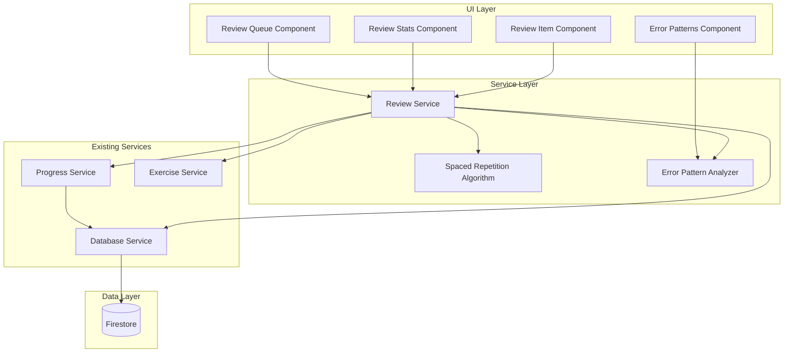

# Design Document: Smart Review System

## Overview

The Smart Review System implements a spaced repetition learning methodology to optimize vocabulary and grammar retention. The system analyzes user performance data from the existing `ProgressService`, applies the SM-2 (SuperMemo 2) algorithm to schedule optimal review intervals, and provides intelligent recommendations for exercises that need review. The design integrates seamlessly with the existing Angular 20 standalone component architecture and leverages signals for reactive state management.

## Architecture

### High-Level Architecture



### Component Hierarchy

```
app-root
├── app-header
│   └── Review Queue Badge (notification count)
├── app-review-queue (new)
│   ├── app-review-queue-item (new) [*ngFor]
│   └── app-review-stats (new)
├── app-error-patterns (new)
│   └── Pattern Analysis Cards
└── app-exercise-detail (existing - enhanced)
    └── Quick Review Mode Toggle
```

## Components and Interfaces

### 1. Review Service (`review.service.ts`)

**Purpose**: Core service managing review scheduling, recommendations, and error pattern analysis.

**Key Responsibilities**:
- Calculate review schedules using SM-2 algorithm
- Generate prioritized review queue
- Track error patterns across exercises
- Manage review history and intervals
- Provide review statistics

**Public API**:

```typescript
interface ReviewService {
  // Review Queue Management
  getReviewQueue(): Observable<ReviewQueueItem[]>;
  getReviewQueueSignal(): Signal<ReviewQueueItem[]>;
  
  // Review Scheduling
  scheduleNextReview(exerciseId: string, performance: number): void;
  getNextReviewDate(exerciseId: string): Date | null;
  getDueReviews(): Observable<ReviewQueueItem[]>;
  
  // Error Pattern Analysis
  getErrorPatterns(): Observable<ErrorPattern[]>;
  getWeakPoints(): Observable<WeakPoint[]>;
  generateCustomExercise(weakPoint: WeakPoint): Observable<Exercise>;
  
  // Statistics
  getReviewStats(): Observable<ReviewStats>;
  getReviewHistory(exerciseId: string): Observable<ReviewHistoryEntry[]>;
  
  // Quick Review Mode
  getIncorrectQuestions(exerciseId: string): SentenceAttempt[];
}
```

### 2. Spaced Repetition Algorithm (`spaced-repetition.algorithm.ts`)

**Purpose**: Implements SM-2 algorithm for optimal review scheduling.

**Algorithm Details**:
- **Easiness Factor (EF)**: Starts at 2.5, adjusted based on performance
- **Intervals**: 1 day → 3 days → 7 days → 14 days → 30 days
- **Performance Grades**:
  - Grade 5 (Perfect): score ≥ 95%
  - Grade 4 (Good): score ≥ 85%
  - Grade 3 (Pass): score ≥ 75%
  - Grade 2 (Fail): score ≥ 60%
  - Grade 1 (Poor): score < 60%

**Formula**:
```
EF' = EF + (0.1 - (5 - grade) * (0.08 + (5 - grade) * 0.02))
If grade < 3: interval = 1 day (reset)
If grade ≥ 3: interval = previous_interval * EF'
```

**Public API**:

```typescript
interface SpacedRepetitionAlgorithm {
  calculateNextInterval(
    currentInterval: number,
    easinessFactor: number,
    performanceScore: number
  ): ReviewSchedule;
  
  getPerformanceGrade(score: number): number;
  adjustEasinessFactor(currentEF: number, grade: number): number;
}

interface ReviewSchedule {
  nextReviewDate: Date;
  interval: number; // in days
  easinessFactor: number;
}
```

### 3. Error Pattern Analyzer (`error-pattern-analyzer.ts`)

**Purpose**: Identifies recurring errors and suggests targeted practice.

**Analysis Strategy**:
- Group errors by type (grammar, vocabulary, structure, spelling)
- Track frequency across exercises
- Identify patterns (e.g., "always confuses 'their' vs 'there'")
- Map errors to grammar rules and vocabulary lists

**Public API**:

```typescript
interface ErrorPatternAnalyzer {
  analyzePatterns(attempts: ExerciseAttempt[]): ErrorPattern[];
  identifyWeakPoints(patterns: ErrorPattern[]): WeakPoint[];
  suggestGrammarLessons(weakPoint: WeakPoint): GrammarLesson[];
  generateVocabularyDrill(weakPoint: WeakPoint): VocabularyDrill;
}

interface ErrorPattern {
  id: string;
  type: 'grammar' | 'vocabulary' | 'structure' | 'spelling';
  description: string;
  frequency: number;
  affectedExercises: string[];
  examples: FeedbackItem[];
  grammarRule?: string;
  vocabularyWords?: string[];
}

interface WeakPoint {
  id: string;
  category: string;
  description: string;
  errorCount: number;
  lastOccurrence: Date;
  improvementRate: number; // percentage
  relatedPatterns: string[];
}
```

### 4. Review Queue Component (`review-queue.ts`)

**Purpose**: Displays prioritized list of exercises needing review.

**Features**:
- Color-coded urgency indicators (red/yellow/green)
- Estimated review time per exercise
- Filter by urgency level
- Sort options (urgency, due date, difficulty)
- Quick review mode toggle

**Template Structure**:

```html
<div class="review-queue">
  <app-review-stats [stats]="reviewStats()" />
  
  <div class="filters">
    <button (click)="filterByUrgency('high')">Urgent</button>
    <button (click)="filterByUrgency('medium')">Due Soon</button>
    <button (click)="filterByUrgency('low')">Scheduled</button>
  </div>
  
  <div class="queue-list">
    @for (item of filteredQueue(); track item.exerciseId) {
      <app-review-queue-item 
        [item]="item"
        (startReview)="startReview($event)"
        (startQuickReview)="startQuickReview($event)" />
    }
  </div>
</div>
```

### 5. Review Queue Item Component (`review-queue-item.ts`)

**Purpose**: Individual review item card with exercise details and actions.

**Display Information**:
- Exercise title and difficulty
- Urgency indicator (colored badge)
- Last attempt score
- Next review date
- Estimated time
- Quick review option

### 6. Review Stats Component (`review-stats.ts`)

**Purpose**: Dashboard showing review statistics and progress.

**Metrics Displayed**:
- Reviews completed this week
- Average score improvement
- Current streak
- Weak points improved
- Review consistency chart (30-day view)

### 7. Error Patterns Component (`error-patterns.ts`)

**Purpose**: Visualizes error patterns and provides targeted practice suggestions.

**Features**:
- List of identified error patterns
- Frequency charts
- Grammar lesson recommendations
- Vocabulary drill generator
- Custom exercise creator for weak points

## Data Models

### Review Data Model

```typescript
interface ReviewData {
  exerciseId: string;
  userId: string;
  
  // Spaced Repetition Data
  easinessFactor: number; // SM-2 EF (default: 2.5)
  interval: number; // days until next review
  nextReviewDate: Date;
  repetitionCount: number;
  
  // Performance Tracking
  lastReviewDate: Date;
  lastScore: number;
  averageScore: number;
  reviewHistory: ReviewHistoryEntry[];
  
  // Quick Review Data
  incorrectSentenceIndices: number[];
  
  // Metadata
  createdAt: Date;
  updatedAt: Date;
}

interface ReviewHistoryEntry {
  date: Date;
  score: number;
  interval: number;
  easinessFactor: number;
  timeSpent: number; // seconds
}

interface ReviewQueueItem {
  exerciseId: string;
  exercise: Exercise;
  urgency: 'high' | 'medium' | 'low';
  nextReviewDate: Date;
  lastScore: number;
  estimatedTime: number; // minutes
  incorrectQuestionCount: number;
  reviewData: ReviewData;
}

interface ReviewStats {
  reviewsThisWeek: number;
  averageScoreImprovement: number; // percentage
  weakPointsImproved: number;
  currentStreak: number;
  consistencyData: ConsistencyDataPoint[];
  totalReviewsCompleted: number;
}

interface ConsistencyDataPoint {
  date: string; // YYYY-MM-DD
  reviewCount: number;
}

interface GrammarLesson {
  id: string;
  title: string;
  description: string;
  rule: string;
  examples: string[];
  relatedErrorPattern: string;
}

interface VocabularyDrill {
  id: string;
  words: string[];
  exercises: Exercise[];
  targetWeakPoint: string;
}
```

### Firestore Collection Structure

```
users/{userId}/
  ├── progress (existing)
  └── reviews/
      ├── {exerciseId} (ReviewData)
      ├── {exerciseId} (ReviewData)
      └── ...
```

## Error Handling

### Service-Level Error Handling

1. **Firestore Connection Errors**:
   - Retry logic with exponential backoff
   - Fallback to cached data
   - User notification for persistent failures

2. **Algorithm Calculation Errors**:
   - Validate input data before calculations
   - Use default values for missing data
   - Log errors for debugging

3. **Data Migration Errors**:
   - Graceful degradation if review data is missing
   - Initialize with default values
   - Preserve existing progress data

### Component-Level Error Handling

1. **Empty Review Queue**:
   - Display encouraging message
   - Suggest exploring new exercises
   - Show overall progress stats

2. **Failed Review Load**:
   - Show error message with retry option
   - Allow offline mode with cached data
   - Provide manual refresh button

## Testing Strategy

### Unit Tests

1. **Spaced Repetition Algorithm**:
   - Test interval calculations for all performance grades
   - Verify easiness factor adjustments
   - Test edge cases (first review, perfect scores, failures)

2. **Error Pattern Analyzer**:
   - Test pattern identification with mock data
   - Verify frequency calculations
   - Test weak point categorization

3. **Review Service**:
   - Test queue generation and sorting
   - Verify review scheduling logic
   - Test statistics calculations

### Integration Tests

1. **Service Integration**:
   - Test ReviewService with ProgressService
   - Verify Firestore data persistence
   - Test real-time updates

2. **Component Integration**:
   - Test review queue with real exercise data
   - Verify navigation to exercise detail
   - Test quick review mode activation

### E2E Tests

1. **Complete Review Flow**:
   - User views review queue
   - User starts review
   - System updates schedule after completion
   - User sees updated statistics

2. **Error Pattern Flow**:
   - System identifies patterns after multiple attempts
   - User views error patterns
   - User starts targeted practice
   - System tracks improvement

## Performance Considerations

### Optimization Strategies

1. **Data Loading**:
   - Lazy load review history (only when needed)
   - Cache review queue in memory
   - Use signals for reactive updates without unnecessary re-renders

2. **Algorithm Efficiency**:
   - Pre-calculate review dates during idle time
   - Batch Firestore updates
   - Use indexes for query optimization

3. **Component Performance**:
   - Virtual scrolling for large review queues
   - OnPush change detection strategy
   - Computed signals for derived state

### Firestore Query Optimization

```typescript
// Indexed queries for performance
const dueReviewsQuery = query(
  collection(db, `users/${userId}/reviews`),
  where('nextReviewDate', '<=', new Date()),
  orderBy('nextReviewDate', 'asc'),
  limit(50)
);
```

## Integration Points

### 1. Progress Service Integration

- Read `ExerciseAttempt` data for review scheduling
- Subscribe to progress updates for real-time queue updates
- Use existing `exerciseHistory` for error pattern analysis

### 2. Exercise Service Integration

- Fetch exercise details for review queue display
- Support both regular and custom exercises
- Use existing filtering for difficulty-based recommendations

### 3. Database Service Integration

- Extend with review data CRUD operations
- Maintain consistency with existing progress data
- Support real-time sync for review updates

### 4. Exercise Detail Component Enhancement

- Add quick review mode toggle
- Filter sentences to show only incorrect ones
- Track quick review completion separately

### 5. Header Component Enhancement

- Add review queue badge with due count
- Notification indicator for urgent reviews
- Link to review queue page

## Accessibility Considerations

1. **Keyboard Navigation**:
   - Tab through review queue items
   - Enter to start review
   - Arrow keys for navigation

2. **Screen Reader Support**:
   - ARIA labels for urgency indicators
   - Announce review statistics
   - Descriptive button labels

3. **Visual Indicators**:
   - High contrast urgency colors
   - Text labels in addition to colors
   - Focus indicators for interactive elements

4. **Responsive Design**:
   - Mobile-friendly review queue
   - Touch-friendly buttons
   - Readable text sizes

## Security Considerations

1. **Data Access**:
   - User can only access their own review data
   - Firestore security rules enforce user isolation
   - Validate user authentication before operations

2. **Input Validation**:
   - Validate exercise IDs before queries
   - Sanitize user input in custom exercises
   - Prevent injection attacks

## Future Enhancements

1. **Advanced Analytics**:
   - Predictive modeling for optimal review times
   - Personalized difficulty adjustments
   - Learning velocity tracking

2. **Social Features**:
   - Compare review stats with friends
   - Shared weak point challenges
   - Community-generated practice exercises

3. **Gamification**:
   - Review streak achievements
   - Mastery badges for weak points
   - Leaderboards for consistent reviewers

4. **AI Integration**:
   - AI-generated custom exercises for weak points
   - Personalized grammar explanations
   - Adaptive difficulty based on performance trends
