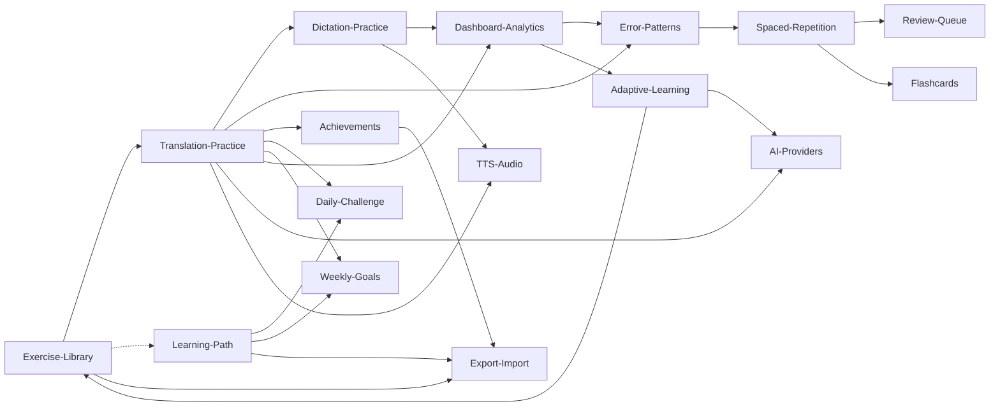

# Daily English — Obsidian Vault

> **Vault này** là tài liệu các chức năng hiện có của ứng dụng `daily-english` (Angular 20), được tổ chức theo phong cách Obsidian với `[[wikilinks]]` để dễ điều hướng và xem backlinks.
>
> Mở thư mục `docs/obsidian/` này dưới dạng **Vault** trong Obsidian (`File > Open folder as vault`) để có trải nghiệm tốt nhất.

---

## 🗺️ Map of Content (MOC)

### 📘 Tổng quan
- [[App-Overview]] — Sản phẩm là gì, ai dùng, giá trị cốt lõi
- [[Architecture]] — Kiến trúc tổng thể, layered, signal, storage routing

### 🎯 Tính năng người dùng (features/)

**Vòng lặp luyện tập:**
- [[Exercise-Library]] — Thư viện 250+ bài tập theo 3 cấp × 8 chủ đề
- [[Translation-Practice]] — Dịch câu Việt → Anh với AI chấm điểm
- [[Dictation-Practice]] — Nghe chính tả bản dịch
- [[Pronunciation-Practice]] — Luyện phát âm với phản hồi AI (Beta)
- [[Custom-Exercises]] — Tự tạo / chỉnh sửa bài tập riêng

**Lộ trình & mục tiêu:**
- [[Learning-Path]] — Lộ trình có cấu trúc theo tuần, có chứng chỉ
- [[Daily-Challenge]] — Thử thách mỗi ngày + streak
- [[Weekly-Goals]] — Mục tiêu tuần và điểm thưởng

**Ôn tập thông minh:**
- [[Spaced-Repetition]] — Thuật toán SM-2 lập lịch ôn
- [[Review-Queue]] — Hàng đợi ôn tập theo độ khẩn
- [[Flashcards]] — Thẻ ghi nhớ từ vựng (Beta)
- [[Error-Patterns]] — Phân tích lỗi thường gặp
- [[Adaptive-Learning]] — Đề xuất bài tập phù hợp năng lực

**Phân tích & gamification:**
- [[Dashboard-Analytics]] — 12+ widget thống kê tiến độ
- [[Achievements]] — Hệ thống huy hiệu (60+ achievement)
- [[Favorites]] — Bookmark bài tập

**Tiện ích:**
- [[TTS-Audio]] — Text-to-Speech đọc bản dịch
- [[Notifications]] — Thông báo nhắc nhở
- [[Export-Import]] — Sao lưu / khôi phục JSON

### ⚙️ Hệ thống nền tảng (systems/)
- [[AI-Providers]] — 4 nhà cung cấp AI (OpenRouter, Gemini, OpenAI, Azure)
- [[Authentication]] — Đăng nhập Supabase OAuth + guards
- [[Storage-Sync]] — Multi-DB Supabase + localStorage + adapter pattern
- [[Analytics]] — GA4 + internal analytics + event queue
- [[SEO]] — SEO tiếng Việt, Cốc Cốc, sitemap generator
- [[PWA-Offline]] — PWA manifest, Service Worker offline-first caching, session lock
- [[i18n-Migration]] — Pattern di chuyển từ Vietnamese-only sang multi-locale (foundation ready)

### 📚 Tham chiếu (reference/)
- [[Routes-Map]] — Bảng route → component → feature

### 🗒️ Kế hoạch
- [[Backlog]] — Backlog & plan các tính năng tương lai (Quick Wins → Phase 5)

---

## 🕸️ Quan hệ chính giữa các ghi chú

> Mở **Graph View** trong Obsidian để xem toàn bộ mạng lưới liên kết.

---

## 🚀 Bắt đầu đọc từ đâu?

1. **Người mới:** đọc [[App-Overview]] → [[Architecture]] → chọn một feature trong danh sách trên.
2. **Tìm hiểu vòng lặp chính:** [[Exercise-Library]] → [[Translation-Practice]] → [[Achievements]] → [[Dashboard-Analytics]].
3. **Hiểu nền tảng kỹ thuật:** [[Architecture]] → [[Storage-Sync]] → [[AI-Providers]].
4. **Tra cứu route nhanh:** [[Routes-Map]].

---

## 🏷️ Quy ước tag

- `#feature/...` — gắn vào tính năng người dùng
- `#system/...` — gắn vào nền tảng kỹ thuật
- `#status/active` — đang hoạt động
- `#status/beta` — beta (cần guard)
- `#status/deprecated` — đã ngừng/đang thay thế
