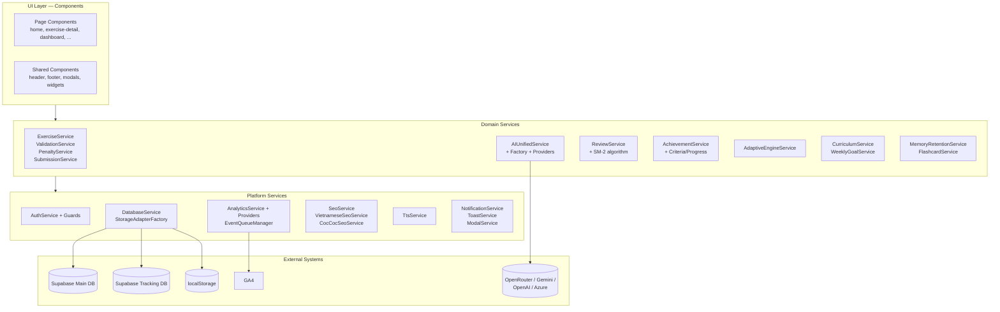

# Architecture

> **Tags:** #overview #system  
> **Trạng thái:** Active

## Tóm tắt kiến trúc

Daily English là **Angular 20 SPA** với:
- **Standalone Components** + **lazy-loaded routes** (xem [[Routes-Map]]).
- **Signal-based reactive state** (Angular 20 Signals).
- **Service layer phân tầng** theo domain (Practice, AI, Achievement, Analytics, Storage, ...).
- **Storage adapter pattern** chọn LocalStorage cho khách hoặc Supabase cho user đăng nhập ([[Storage-Sync]]).
- **Multi-provider AI** qua factory + base provider ([[AI-Providers]]).
- **PWA-ready** với manifest và offline event queue ([[PWA-Offline]]).

## Sơ đồ tầng



## Các tầng

### UI Layer
- **Page components** (lazy-loaded, định nghĩa trong [src/app/app.routes.ts](../../src/app/app.routes.ts)) — xem [[Routes-Map]].
- **Reusable widgets** trong [src/app/components/dashboard/](../../src/app/components/dashboard/), [src/app/components/achievements/](../../src/app/components/achievements/), [src/app/components/learning-path/](../../src/app/components/learning-path/).
- **Global components** (header, footer, toast-container) gắn trong `app.html`.

### Domain Services
- Tổ chức theo **bounded context**: mỗi feature có service riêng + service helper.
- Phối hợp qua **Angular DI** + RxJS Observables + Angular Signals.
- Ví dụ: `ExerciseService` ([src/app/services/exercise.service.ts](../../src/app/services/exercise.service.ts)) → `ValidationService` → `PenaltyService` → `SubmissionService` → `ProgressService` → `DatabaseService`.

### Platform Services
- **AuthService** ([[Authentication]]) là nguồn duy nhất xác định "logged in?". Service khác dùng nó (thường lazy inject) để chọn storage provider.
- **DatabaseService** ([[Storage-Sync]]) là facade trên `SupabaseDatabaseService` + `LocalStorageProvider`. Mọi I/O đi qua đây.
- **AnalyticsService** ([[Analytics]]) là multi-provider — đăng ký GA4 + internal + guest provider khi khởi động (xem `app.config.ts`).

## App bootstrap

[src/app/app.config.ts](../../src/app/app.config.ts) khởi tạo:

1. `provideRouter(routes, withPreloading(SelectivePreloadStrategy))` — chỉ preload các route đánh dấu `data.preload: 'high'`.
2. `provideHttpClient(withInterceptors([cacheInterceptor]))` — cache HTTP có chọn lọc.
3. `provideClientHydration()` — hỗ trợ SSR / prerender.
4. `CustomRouteReuseStrategy` — giữ state khi back/forward giữa các route.
5. **4 `provideAppInitializer`** chạy nền sau khi app boot:
   - `initializeSeo` — set structured data mặc định.
   - `initializeVietnameseSeo` — load config + áp dụng Cốc Cốc optimizations (xem [[SEO]]).
   - `initializeAnalytics` — đăng ký các analytics provider từ `environment.analytics.providers` (xem [[Analytics]]).
   - `SessionTrackingService` — bắt đầu theo dõi phiên người dùng.

## Routing

- **Lazy-load mọi page component** qua `loadComponent: () => import(...)`.
- **3 guard:** [src/app/guards/auth.guard.ts](../../src/app/guards/auth.guard.ts), [src/app/guards/login.guard.ts](../../src/app/guards/login.guard.ts) (chặn user đã login truy cập trang login), [src/app/guards/beta-feature.guard.ts](../../src/app/guards/beta-feature.guard.ts) (gate [[Flashcards]]).
- **SEO data** gắn vào `route.data.seo` + `vietnamese` — đọc bởi `SeoService` qua router events.
- **Preload tag:** `data.preload: 'high'` cho các route quan trọng (home, exercises, dashboard, learning-path, about).

## Persistence strategy

Mọi I/O đi qua **DatabaseService** (facade):

```
ProgressService / AchievementService / ReviewService
        ↓
DatabaseService (facade)
        ↓
StorageAdapterFactory  →  LocalStorageProvider (guest)
                       ↓
                       SupabaseStorageProvider (auth)
                              ↓
                       SupabaseDatabaseService (main DB)
                       SupabaseTrackingService (tracking DB)
```

Chi tiết tại [[Storage-Sync]]. Có 2 Supabase project: main DB (user data, achievements, favorites) + tracking DB (exercise history, daily challenge, weekly goal) — phân tải.

## Build pipeline

- `npm run build` → Angular build production.
- `prebuild` → [scripts/generate-sitemap.js](../../scripts/generate-sitemap.js) sinh `sitemap.xml` từ routes + danh sách exercise.
- `postbuild` → [scripts/generate-static-pages.js](../../scripts/generate-static-pages.js) prerender các trang quan trọng.
- `combine-exercises` → [scripts/combine-exercises.js](../../scripts/combine-exercises.js) gộp các JSON exercise theo cấp/chủ đề → `all-exercises.json`.

## Liên kết

- **Trước đó:** [[App-Overview]]
- **Đào sâu:** [[Storage-Sync]], [[AI-Providers]], [[Analytics]], [[SEO]], [[PWA-Offline]]
- **Tra cứu:** [[Routes-Map]]
