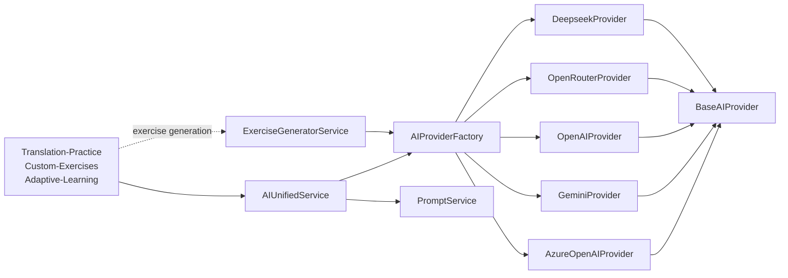

# AI Providers

> **Tags:** #system/ai #status/active  
> **Pattern:** Factory + Strategy

## Tổng quan

App hỗ trợ **4 nhà cung cấp AI**, user chọn 1 trong cài đặt. API key lưu trong `localStorage` của trình duyệt, **không gửi qua server riêng** — chỉ gửi tới chính nhà cung cấp đó.

| Provider | Đặc điểm | Miễn phí? |
|---|---|---|
| **OpenRouter** (recommended) | 1 API key truy cập nhiều model (Llama 3.2/3.1, Gemma, Phi-3, Mistral, Hermes, ...) | Có — không cần thẻ |
| **Google Gemini** | `gemini-2.5-pro` | Có tier free |
| **OpenAI** | `gpt-5` | Trả tiền (pay-as-you-go) |
| **Azure OpenAI** | Enterprise, cần Azure subscription | Trả tiền |

Default trong `environment.ts`: `aiProvider: 'azure'`.

## Kiến trúc



### Files

- [services/ai/ai-unified.service.ts](../../src/app/services/ai/ai-unified.service.ts) — facade chính cho consumer.
- [services/ai/ai-provider.factory.ts](../../src/app/services/ai/ai-provider.factory.ts) — instantiate provider theo `AIConfig.provider`.
- [services/ai/base-ai-provider.ts](../../src/app/services/ai/base-ai-provider.ts) — abstract base với HTTP helpers, error handling, streaming parse.
- [services/ai/providers/azure-openai.provider.ts](../../src/app/services/ai/providers/azure-openai.provider.ts)
- [services/ai/providers/gemini.provider.ts](../../src/app/services/ai/providers/gemini.provider.ts)
- [services/ai/providers/openai.provider.ts](../../src/app/services/ai/providers/openai.provider.ts)
- [services/ai/providers/openrouter.provider.ts](../../src/app/services/ai/providers/openrouter.provider.ts)
- [services/ai/providers/deepseek.provider.ts](../../src/app/services/ai/providers/deepseek.provider.ts) — provider phụ.
- [services/ai/prompt.service.ts](../../src/app/services/ai/prompt.service.ts) — build prompt cho từng use case (analyze, hint, generate).
- [services/ai/exercise-generator.service.ts](../../src/app/services/ai/exercise-generator.service.ts) — sinh bài tập từ prompt (cho [[Custom-Exercises]]).

## Hợp đồng `AIProvider`

```ts
interface AIProvider {
  analyzeText(userInput, sourceText, context): Observable<AIResponse>;
  analyzeTextStream(userInput, sourceText, context): Observable<AIStreamChunk>;
  generateHint(sourceText, userInput, previousHints, context): Observable<string>;
  validateCredentials(): Observable<boolean>;
}
```

### Streaming

`AIStreamChunk.type`: `'score' | 'feedback' | 'comment' | 'complete' | 'error'`. Cho phép UI hiển thị progressive — score xuất hiện sớm, từng `FeedbackItem` được stream về để user thấy phản hồi gần như tức thì.

### Output: `AIResponse`

- `accuracyScore: number` (0–100)
- `feedback: FeedbackItem[]` — từng góp ý có `type`, `originalText`, `suggestion`, `explanation`, `startIndex`, `endIndex` để highlight inline.
- `overallComment: string` — nhận xét chung.

## Cấu hình runtime

User cấu hình qua `/profile` → ApiKeyPrompt modal:

```ts
interface AIConfig {
  provider: 'azure' | 'gemini' | 'openai' | 'openrouter';
  azure?: { endpoint; apiKey; deploymentName };
  gemini?: { apiKey; modelName };
  openai?: { apiKey; modelName };
  openrouter?: { apiKey; modelName; siteUrl?; siteName? };
}
```

Lưu vào `localStorage` qua `ConfigService` ([services/config.service.ts](../../src/app/services/config.service.ts)).

## Liên kết

- **Tiêu thụ bởi:** [[Translation-Practice]] (analyze + hint), [[Custom-Exercises]] (generate), [[Adaptive-Learning]] (hint)
- **Cấu hình UI:** `/profile` (ApiKeyPrompt modal)
- **Lưu key:** `localStorage` (qua `ConfigService`), không sync Supabase
- **Tracking:** [[Analytics]] (đếm số request, latency, error)
