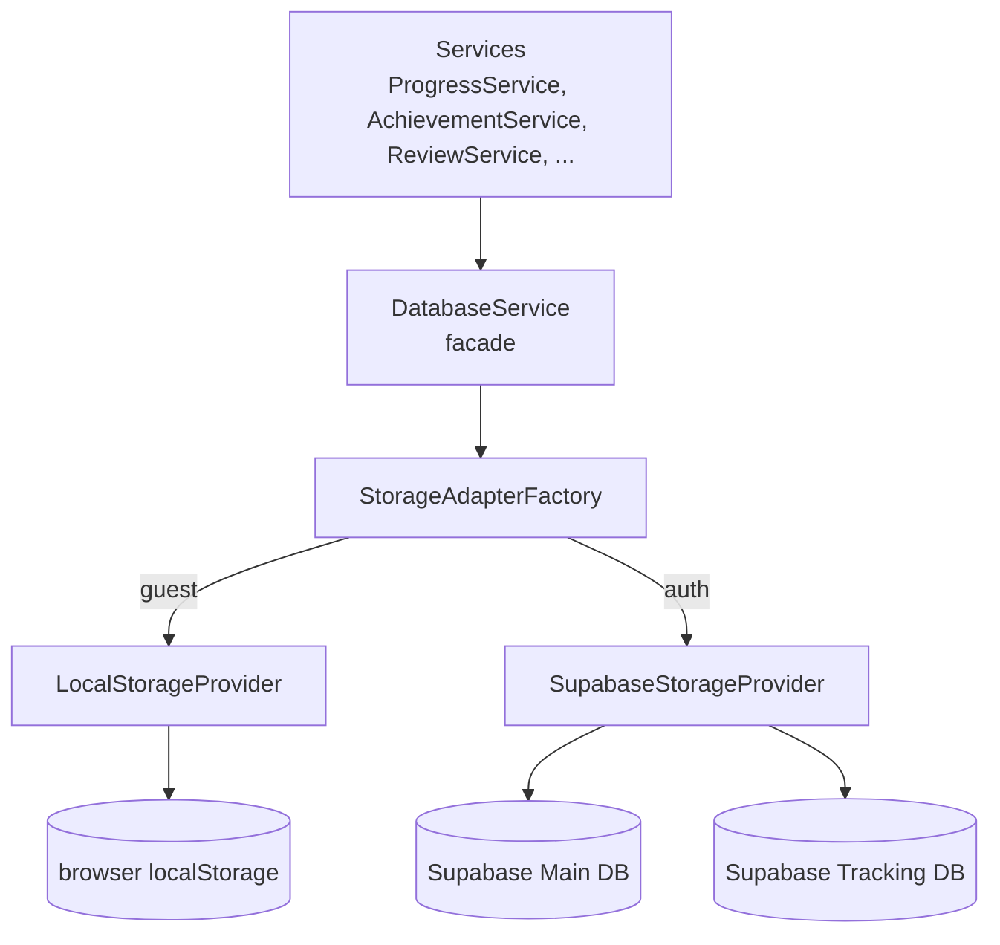

# Storage / Sync

> **Tags:** #system/storage #status/active  
> **Pattern:** Adapter + Facade

## Tổng quan

Mọi I/O của app đi qua **`DatabaseService`** (facade). Service này chọn backend dựa trên trạng thái [[Authentication]]:

- **Guest** → `LocalStorageProvider` (browser `localStorage`).
- **Đăng nhập** → `SupabaseStorageProvider` → 2 Supabase project song song:
  - **Main DB** — user data, profile, achievements, favorites, custom exercises, learning path progress.
  - **Tracking DB** — exercise history, dictation history, daily challenge, weekly goal (phân tải).

## Sơ đồ

## Files chính

- [services/database.service.ts](../../src/app/services/database.service.ts) — facade.
- [services/storage-adapter-factory.service.ts](../../src/app/services/storage-adapter-factory.service.ts) — chọn provider.
- [services/local-storage-provider.service.ts](../../src/app/services/local-storage-provider.service.ts) — adapter localStorage.
- [services/storage/supabase-storage-provider.service.ts](../../src/app/services/storage/supabase-storage-provider.service.ts) — adapter Supabase.
- [services/database/supabase-database.service.ts](../../src/app/services/database/supabase-database.service.ts) — Supabase **main DB** operations.
- [services/database/supabase-tracking.service.ts](../../src/app/services/database/supabase-tracking.service.ts) — Supabase **tracking DB** operations.
- [services/supabase.client.ts](../../src/app/services/supabase.client.ts) — khởi tạo 2 Supabase client.

### Compressor utilities

Trước khi ghi xuống storage, dữ liệu được nén để giảm dung lượng:

- [services/progress-compressor.ts](../../src/app/services/progress-compressor.ts) / `progress-decompressor.ts`
- [services/achievement-compressor.ts](../../src/app/services/achievement-compressor.ts)
- [services/review-compressor.ts](../../src/app/services/review-compressor.ts) / `review-decompressor.ts`

Mục đích: giữ `UserProgress` đủ nhỏ để fit trong giới hạn của localStorage (~5–10 MB) và giảm payload Supabase.

## Constants

- [src/app/constants/storage-keys.ts](../../src/app/constants/storage-keys.ts) — chuỗi key dùng cho `localStorage` (tránh typo, dễ migrate).

## Migration utilities

- [services/progress-migration.utility.ts](../../src/app/services/progress-migration.utility.ts) — migrate `UserProgress` format cũ → mới (vd. `exerciseHistory` từ array → map).
- [services/review-migration.utility.ts](../../src/app/services/review-migration.utility.ts) — migrate review data.

## Đặc tả Supabase

**Main DB** (`environment.supabase`):
- Bảng user_progress, custom_exercises, user_achievements, favorites, user_path_progress, ...

**Tracking DB** (`environment.supabaseTracking`):
- Bảng exercise_attempts, dictation_attempts, daily_challenges, weekly_goals, session_events, ...

Tách 2 project để **tránh saturate quota** một project khi tracking volume cao.

### RLS (Row-Level Security)

Mọi bảng có `user_id` đều áp policy `user_id = auth.uid()` để user chỉ truy cập dữ liệu của mình.

## Khi user login

1. AuthService phát `currentUser` mới.
2. `StorageAdapterFactory` chuyển sang `SupabaseStorageProvider`.
3. Service nào (vd. `ProgressService`) đọc data trước hết phải:
   - Đọc local data.
   - Đọc Supabase data.
   - Merge (giữ bản có `accuracyScore` cao hơn / `updatedAt` mới hơn cho cùng `exerciseId`).
   - Ghi lại cả 2 (đồng bộ).

## Khi offline

- Ghi vào `localStorage` ngay.
- Event tracking đẩy vào queue (xem [[Analytics]] và [[PWA-Offline]]).
- Khi online lại → flush queue lên Supabase.

## Liên kết

- **Sử dụng bởi:** mọi feature — [[Translation-Practice]], [[Dictation-Practice]], [[Achievements]], [[Learning-Path]], [[Daily-Challenge]], [[Weekly-Goals]], [[Review-Queue]], [[Flashcards]], [[Favorites]], [[Custom-Exercises]], [[Export-Import]]
- **Phụ thuộc:** [[Authentication]] (chọn provider)
- **Liên quan:** [[PWA-Offline]] (offline queue)
